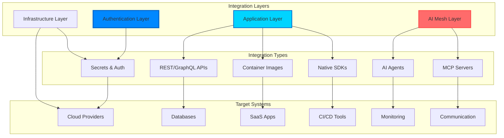

# Integrations

Kubiya provides a unified integration layer that seamlessly connects your infrastructure, applications, cloud services, and AI capabilities. This creates an intelligent automation mesh that spans both application and infrastructure layers.

## Integration Architecture



## Integration Management API

Kubiya provides a comprehensive API for managing integrations programmatically:

### Listing Available Integrations

```python
from kubiya_workflow_sdk import KubiyaClient

client = KubiyaClient(api_key="your-key")

# Get all available integrations
integrations = client.get_integrations()

for integration in integrations:
    print(f"Name: {integration['name']}")
    print(f"Type: {integration['integration_type']}")
    print(f"Auth: {integration.get('auth_type', 'none')}")
    print(f"Status: {integration.get('status', 'active')}")
```

### Integration Types

Kubiya supports several integration categories:

<Tabs>
  <Tab title="Infrastructure">
    ```python
    # Cloud providers
    aws_integration = {
        "name": "aws-prod",
        "type": "cloud",
        "provider": "aws",
        "auth_type": "iam_role",
        "config": {
            "region": "us-east-1",
            "role_arn": "arn:aws:iam::123456789:role/kubiya-automation"
        }
    }
    
    # Kubernetes clusters
    k8s_integration = {
        "name": "prod-cluster",
        "type": "kubernetes",
        "auth_type": "service_account",
        "config": {
            "cluster_endpoint": "https://k8s.company.com",
            "namespace": "production"
        }
    }
    ```
  </Tab>
  
  <Tab title="Applications">
    ```python
    # SaaS applications
    github_integration = {
        "name": "github-org",
        "type": "vcs",
        "provider": "github",
        "auth_type": "oauth2",
        "config": {
            "org": "my-company",
            "scopes": ["repo", "workflow"]
        }
    }
    
    # Databases
    postgres_integration = {
        "name": "analytics-db",
        "type": "database",
        "provider": "postgresql",
        "auth_type": "credentials",
        "config": {
            "host": "db.internal.com",
            "port": 5432,
            "database": "analytics"
        }
    }
    ```
  </Tab>
  
  <Tab title="AI Services">
    ```python
    # LLM providers
    openai_integration = {
        "name": "openai-gpt4",
        "type": "ai",
        "provider": "openai",
        "auth_type": "api_key",
        "config": {
            "model": "gpt-4",
            "temperature": 0.7
        }
    }
    
    # Custom AI services
    ml_service_integration = {
        "name": "recommendation-engine",
        "type": "ai",
        "provider": "custom",
        "auth_type": "bearer_token",
        "config": {
            "endpoint": "https://ml.company.com/v1/predict"
        }
    }
    ```
  </Tab>
</Tabs>

## Authentication Scenarios

### 1. Multi-Account AWS IAM

For complex AWS environments with multiple accounts and varying credentials:

```python
from kubiya_workflow_sdk import step

# Step 1: Assume role in production account
prod_creds = step("assume-prod-role").docker(
    image="amazon/aws-cli:latest",
    command="""
    aws sts assume-role \
      --role-arn arn:aws:iam::111111111111:role/kubiya-prod \
      --role-session-name kubiya-automation \
      --output json
    """
).output("PROD_CREDS").env(
    variables={
        "AWS_ACCESS_KEY_ID": "${secrets.aws_master_key}",
        "AWS_SECRET_ACCESS_KEY": "${secrets.aws_master_secret}"
    }
)

# Step 2: Use production credentials
step("deploy-to-prod").docker(
    image="amazon/aws-cli:latest",
    command="""
    # Parse credentials from previous step
    export AWS_ACCESS_KEY_ID=$(echo $PROD_CREDS | jq -r '.Credentials.AccessKeyId')
    export AWS_SECRET_ACCESS_KEY=$(echo $PROD_CREDS | jq -r '.Credentials.SecretAccessKey')
    export AWS_SESSION_TOKEN=$(echo $PROD_CREDS | jq -r '.Credentials.SessionToken')

    # Deploy using production credentials
    aws ecs update-service --cluster prod --service app --force-new-deployment
    """
).depends("assume-prod-role").env(
    variables={"PROD_CREDS": "${PROD_CREDS}"}
)

# Step 3: Assume role in staging account
staging_creds = step("assume-staging-role").docker(
    image="amazon/aws-cli:latest",
    command="""
    aws sts assume-role \
      --role-arn arn:aws:iam::222222222222:role/kubiya-staging \
      --role-session-name kubiya-automation
    """
).output("STAGING_CREDS").env(
    variables={
        "AWS_ACCESS_KEY_ID": "${secrets.aws_master_key}",
        "AWS_SECRET_ACCESS_KEY": "${secrets.aws_master_secret}"
    }
)
```

### 2. Certificate-Based Authentication

For systems requiring mTLS or certificate authentication:

```python
from kubiya_workflow_sdk import step

# Step 1: Retrieve certificates from secure store
certs = step("get-certificates").docker(
    image="kubiya/secret-manager:latest",
    command="retrieve-cert-bundle ${CERT_NAME}",
).output("CERT_BUNDLE").env(
    variables={"CERT_NAME": "api-client-cert"}
)

# Step 2: Use certificates for API calls
step("call-secure-api").docker(
    image="curlimages/curl:latest",
    command="""
    # Extract certificates
    echo "$CERT_BUNDLE" | jq -r '.cert' > /tmp/client.crt
    echo "$CERT_BUNDLE" | jq -r '.key' > /tmp/client.key
    echo "$CERT_BUNDLE" | jq -r '.ca' > /tmp/ca.crt

    # Make authenticated API call
    curl --cert /tmp/client.crt \
         --key /tmp/client.key \
         --cacert /tmp/ca.crt \
         https://secure-api.company.com/v1/data
    """
).depends("get-certificates").env(
    variables={"CERT_BUNDLE": "${CERT_BUNDLE}"}
)
```

## Application Layer Automation

Kubiya makes it easy to automate across your entire application stack:

### 1. API Integration Pattern

```python
from kubiya_workflow_sdk import step

# REST API automation
response = step("call-api").http(
    url="https://api.company.com/v1/users",
    method="POST",
    headers={
        "Authorization": "Bearer ${secrets.api_token}",
        "Content-Type": "application/json"
    },
    body={"name": "New User", "role": "developer"}
).output("API_RESPONSE")

# GraphQL automation
step("graphql-query").http(
    url="https://api.company.com/graphql",
    method="POST",
    headers={"Authorization": "Bearer ${secrets.api_token}"},
    body={
        "query": """
        mutation CreateProject($name: String!) {
            createProject(name: $name) {
                id
                name
                created_at
            }
        }
        """,
        "variables": {"name": "New Project"}
    }
)
```

### 2. Database Operations

```python
from kubiya_workflow_sdk import step

# Multi-database operations
step("sync-databases").docker(
    image="python:3.11",
    command="""
    import psycopg2
    import pymongo
    import redis

    # PostgreSQL operations
    pg_conn = psycopg2.connect(
        host="${secrets.pg_host}",
        user="${secrets.pg_user}",
        password="${secrets.pg_password}"
    )

    # MongoDB operations
    mongo_client = pymongo.MongoClient("${secrets.mongo_uri}")

    # Redis operations
    redis_client = redis.Redis(
        host="${secrets.redis_host}",
        password="${secrets.redis_password}"
    )

    # Sync data between systems
    # ... your logic here ...
    """
)
```

### 3. SaaS Application Integration

```python
from kubiya_workflow_sdk import step

# Salesforce integration
step("update-salesforce").docker(
    image="salesforce/cli:latest",
    command="""
    # Authenticate
    sfdx auth:jwt:grant \
      --clientid ${SALESFORCE_CLIENT_ID} \
      --jwtkeyfile /tmp/server.key \
      --username ${SALESFORCE_USERNAME} \
      --instanceurl ${SALESFORCE_INSTANCE_URL}

    # Update records
    sfdx data:record:update \
      --sobjecttype Account \
      --where "Industry='Technology'" \
      --values "Status='Active'"
    """
).env(
    variables={
        "SALESFORCE_CLIENT_ID": "${secrets.sf_client_id}",
        "SALESFORCE_USERNAME": "${secrets.sf_username}",
        "SALESFORCE_INSTANCE_URL": "https://mycompany.my.salesforce.com"
    }
)
```

## Infrastructure Layer Automation

### Multi-Cloud Infrastructure

```python
from kubiya_workflow_sdk import step

# AWS infrastructure
step("provision-aws").docker(
    image="hashicorp/terraform:latest",
    command="""
    terraform init -backend-config="bucket=${TF_STATE_BUCKET}"
    terraform apply -auto-approve -var="environment=production"
    """
).env(
    variables={
        "AWS_ACCESS_KEY_ID": "${secrets.aws_key}",
        "AWS_SECRET_ACCESS_KEY": "${secrets.aws_secret}",
        "TF_STATE_BUCKET": "company-terraform-state"
    }
)

# Google Cloud infrastructure
step("provision-gcp").docker(
    image="google/cloud-sdk:latest",
    command="""
    # Authenticate with service account
    echo '${GCP_SERVICE_ACCOUNT_KEY}' | gcloud auth activate-service-account --key-file=-

    # Deploy resources
    gcloud deployment-manager deployments create prod-stack \
      --config=infrastructure.yaml
    """
).env(
    variables={
        "GCP_SERVICE_ACCOUNT_KEY": "${secrets.gcp_service_account}"
    }
)

# Azure infrastructure
step("provision-azure").docker(
    image="mcr.microsoft.com/azure-cli:latest",
    command="""
    # Login with service principal
    az login --service-principal \
      -u ${AZURE_CLIENT_ID} \
      -p ${AZURE_CLIENT_SECRET} \
      --tenant ${AZURE_TENANT_ID}

    # Deploy ARM template
    az deployment group create \
      --resource-group production \
      --template-file template.json
    """
).env(
    variables={
        "AZURE_CLIENT_ID": "${secrets.azure_client_id}",
        "AZURE_CLIENT_SECRET": "${secrets.azure_client_secret}",
        "AZURE_TENANT_ID": "${secrets.azure_tenant_id}"
    }
)
```

## AI Mesh Integration

Kubiya's AI mesh allows intelligent orchestration across all layers:

### Intelligent Decision Making

```python
from kubiya_workflow_sdk import step

# Collect metrics from multiple sources
metrics = step("collect-metrics").docker(
    image="python:3.11",
    command="""
    import requests

    # Collect from Prometheus
    prom_data = requests.get("http://prometheus:9090/api/v1/query",
        params={"query": "up"}).json()

    # Collect from CloudWatch
    # ... CloudWatch API calls ...

    # Collect from Datadog
    # ... Datadog API calls ...

    print(json.dumps({"prometheus": prom_data, ...}))
    """
).output("METRICS")

# AI analyzes and decides
decision = step("ai-analysis").inline_agent(
    message="""Analyze these metrics and determine:
    1. Are there any anomalies?
    2. Should we scale up/down?
    3. Any services need attention?

    Metrics: ${METRICS}
    """,
    agent_name="ops-analyst",
    ai_instructions="""You are an expert SRE. Analyze metrics for:
    - Performance anomalies
    - Capacity planning
    - Service health
    Provide specific, actionable recommendations.""",
    runners=["kubiya-hosted"],
    llm_model="gpt-4o"
).output("AI_DECISION")

# Execute AI's recommendations
step("execute-recommendations").docker(
    image="python:3.11",
    command="""
    import json

    decision = json.loads(os.environ['AI_DECISION'])

    for action in decision.get('actions', []):
        if action['type'] == 'scale':
            # Execute scaling
            subprocess.run([
                'kubectl', 'scale',
                f"deployment/{action['target']}",
                f"--replicas={action['replicas']}"
            ])
        elif action['type'] == 'alert':
            # Send alert
            # ... alert logic ...
    """
).depends(["collect-metrics", "ai-analysis"])
```

## Integration Best Practices

### 1. **Credential Management**

<Warning>
  Never hardcode credentials in workflows. Always use Kubiya's secret management.
</Warning>

```python
# ❌ Bad: Hardcoded credentials
step("bad").env({"PASSWORD": "actual-password"})

# ✅ Good: Secret reference
step("good").env({"PASSWORD": "${secrets.db_password}"})
```

### 2. **Integration Error Handling**

```python
# Retry on integration failures
from kubiya_workflow_sdk import step

s = step("api-call").http(
    url="https://flaky-api.com/endpoint",
    method="POST"
).retry(
    limit=3,
    interval_sec=30,
    exponential_base=2.0
).continue_on(
    failure=True,  # Continue workflow even if this fails
    mark_success=True  # Mark as success after retries
)
```

### 3. **Cross-Layer Security**

```python
from kubiya_workflow_sdk import step

# Application layer: Rotate API keys
new_key = step("generate-api-key").docker(
    image="python:3.11",
    command="import secrets; print(secrets.token_urlsafe(32))"
).output("NEW_KEY")

# Infrastructure layer: Update secret in vault
step("update-vault").docker(
    image="vault:latest",
    command="vault kv put secret/api key=${NEW_KEY}"
).env(
    variables={"VAULT_TOKEN": "${secrets.vault_token}"}
)

# Application layer: Update running services
step("rolling-update").docker(
    image="kubectl:latest",
    command="kubectl set env deployment/api API_KEY=${NEW_KEY}"
)
```

## Next Steps

<CardGroup cols={2}>
  <Card title="Secret Management" icon="key" href="/concepts/secrets">
    Learn about secure credential handling
  </Card>
  <Card title="Workflow Examples" icon="code" href="/workflows/examples">
    See integration patterns in action
  </Card>
  <Card title="API Reference" icon="book" href="/api-reference/integrations">
    Complete integrations API docs
  </Card>
  <Card title="Security Guide" icon="shield" href="/security/integrations">
    Secure your integrations
  </Card>
</CardGroup> 