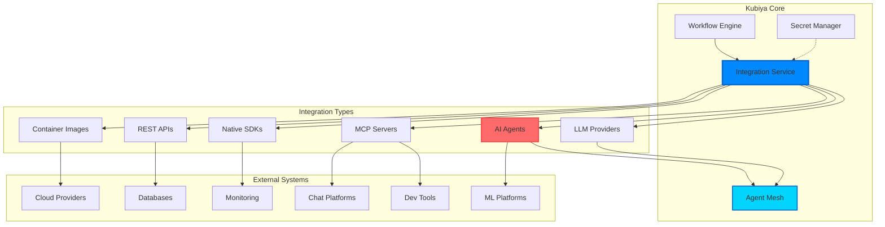

# Integrations

Kubiya provides a rich integration ecosystem that goes beyond simple container orchestration. It creates an intelligent mesh connecting AI agents, LLM providers, containers, cloud services, and your existing tools into unified workflows.

## Integration Architecture



## AI Agent Mesh

Kubiya enables intelligent meshing of AI agents, creating collaborative systems that leverage multiple AI models for complex tasks.

### Inline AI Agents

Embed AI intelligence directly in workflows:

```python
from kubiya_workflow_sdk import workflow, step

@workflow
def intelligent_analysis():
    # AI agent for analysis
    analysis = (
        step("ai-analysis")
        .inline_agent(
            message="Analyze the system performance data: ${METRICS_DATA}",
            agent_name="performance-analyzer",
            ai_instructions="""You are a systems performance expert.
            Analyze:
            1. Resource utilization patterns
            2. Bottlenecks and anomalies
            3. Optimization opportunities
            Provide specific, actionable recommendations.""",
            runners=["auto"],
            llm_model="gpt-4o",
            tools=[{
                "name": "query-metrics",
                "type": "docker",
                "image": "prom/prometheus:latest",
                "content": "promtool query instant '${QUERY}'",
                "args": [{"name": "QUERY", "type": "string"}]
            }]
        )
        .output("ANALYSIS")
    )
    
    # Another AI agent acts on the analysis
    remediation = (
        step("ai-remediation")
        .inline_agent(
            message="Based on this analysis, generate remediation scripts: ${ANALYSIS}",
            agent_name="remediation-generator",
            ai_instructions="Generate safe, tested remediation scripts",
            runners=["auto"],
            llm_model="claude-3-opus"
        )
        .depends("ai-analysis")
        .output("REMEDIATION_SCRIPT")
    )
```

### LLM Provider Integration via ADK

The ADK provider enables sophisticated AI workflow generation using multiple LLM providers:

```python
from kubiya_workflow_sdk.providers import get_provider

# ADK provider with LiteLLM support
adk = get_provider("adk", config={
    "model_provider": "together_ai",
    "models": {
        "orchestrator": "together_ai/deepseek-ai/DeepSeek-V3",
        "context_loader": "together_ai/deepseek-ai/DeepSeek-V3", 
        "workflow_generator": "together_ai/deepseek-ai/DeepSeek-V3",
        "compiler": "together_ai/deepseek-ai/DeepSeek-V3",
        "refinement": "together_ai/deepseek-ai/DeepSeek-V3"
    }
})

# Generate complex workflows using AI
result = await adk.compose(
    task="Create a zero-downtime deployment pipeline with canary releases",
    mode="plan"
)
```

### Multi-Model Orchestration

Leverage different models for different tasks:

```python
@workflow
def multi_model_processing():
    # Fast model for classification
    classify = (
        step("classify")
        .inline_agent(
            message="Classify this request type: ${REQUEST}",
            agent_name="classifier",
            llm_model="gpt-3.5-turbo",  # Fast, cheap
            runners=["auto"]
        )
    )
    
    # Powerful model for complex reasoning
    analyze = (
        step("deep-analysis")
        .inline_agent(
            message="Perform deep analysis based on classification: ${CLASSIFICATION}",
            agent_name="analyzer",
            llm_model="gpt-4o",  # More capable
            runners=["auto"]
        )
        .depends("classify")
    )
    
    # Specialized model for code generation
    generate = (
        step("generate-code")
        .inline_agent(
            message="Generate implementation based on analysis: ${ANALYSIS}",
            agent_name="code-generator",
            llm_model="claude-3-opus",  # Best for code
            runners=["auto"]
        )
        .depends("deep-analysis")
    )
```

## Container-Based Integration

The foundation of Kubiya - orchestrate any containerized tool:

```python
@workflow
def container_mesh():
    # Different containers for different tasks
    
    # Data processing with Python
    process = step("process").docker(
        image="python:3.11-slim",
        script="""
import pandas as pd
df = pd.read_csv('/data/input.csv')
# Processing logic
df.to_parquet('/data/output.parquet')
"""
    )
    
    # Analysis with R
    analyze = step("analyze").docker(
        image="rocker/tidyverse:latest",
        script="""
library(tidyverse)
data <- read_parquet('/data/output.parquet')
# Statistical analysis
"""
    ).depends("process")
    
    # Visualization with Node.js
    visualize = step("visualize").docker(
        image="node:18-alpine",
        script="""
const d3 = require('d3');
// Generate visualizations
"""
    ).depends("analyze")
```

## Cloud Provider Mesh

Seamlessly integrate multiple cloud providers:

```python
@workflow
def multi_cloud_data_sync():
    # Extract from AWS
    aws_extract = step("aws-extract").docker(
        image="amazon/aws-cli:latest",
        command="aws s3 sync s3://source-bucket /data",
        env={"AWS_REGION": "us-east-1"}
    )
    
    # Process with Google Cloud AI
    gcp_process = (
        step("gcp-ai-process")
        .docker(
            image="google/cloud-sdk:latest",
            command="""
gcloud ai custom-jobs create \
  --region=us-central1 \
  --display-name=data-processing \
  --config=job.yaml
"""
        )
        .depends("aws-extract")
    )
    
    # Store in Azure
    azure_store = step("azure-store").docker(
        image="mcr.microsoft.com/azure-cli:latest",
        command="az storage blob upload-batch -d processed -s /data",
        env={"AZURE_STORAGE_ACCOUNT": "myaccount"}
    ).depends("gcp-ai-process")
```

## Database Integration Mesh

Connect to multiple databases in a single workflow:

```python
@workflow
def database_mesh():
    # Read from PostgreSQL
    pg_data = step("read-postgres").docker(
        image="postgres:15",
        command="psql -c 'COPY (SELECT * FROM users) TO STDOUT CSV'",
        env={"PGHOST": "postgres.internal", "PGUSER": "reader"}
    ).output("PG_DATA")
    
    # Read from MongoDB
    mongo_data = step("read-mongo").docker(
        image="mongo:7",
        command="mongoexport --collection=profiles --type=csv",
        env={"MONGO_URI": "mongodb://mongo.internal:27017/app"}
    ).output("MONGO_DATA")
    
    # Join data with DuckDB
    join_data = step("join-data").docker(
        image="datacoves/duckdb:latest",
        script="""
import duckdb
conn = duckdb.connect()
# Load and join data from both sources
users = conn.read_csv_auto('${PG_DATA}')
profiles = conn.read_csv_auto('${MONGO_DATA}')
result = conn.sql("SELECT * FROM users JOIN profiles USING (user_id)")
result.to_csv('/output/joined.csv')
"""
    ).depends(["read-postgres", "read-mongo"])
```

## MCP (Model Context Protocol) Integration

Enable AI assistants to control workflows:

```python
# MCP server for Claude Desktop / Cursor
from kubiya_workflow_sdk.mcp import KubiyaWorkflowServer

server = KubiyaWorkflowServer("kubiya-tools")

@server.tool
async def intelligent_deploy(
    app_name: str,
    environment: str,
    ai_review: bool = True
):
    """Deploy with AI review"""
    
    wf = workflow(f"deploy-{app_name}")
    
    if ai_review:
        # AI reviews deployment plan
        review = (
            step("ai-review")
            .inline_agent(
                message=f"Review deployment plan for {app_name} to {environment}",
                agent_name="deployment-reviewer",
                ai_instructions="Check for security, performance, and reliability issues",
                runners=["auto"]
            )
        )
        wf.add_step(review)
    
    # Actual deployment
    deploy = step("deploy").docker(
        image="kubectl:latest",
        command=f"kubectl apply -f {app_name}.yaml"
    )
    
    if ai_review:
        deploy.depends("ai-review")
        
    wf.add_step(deploy)
    
    return await client.execute_workflow_async(wf)
```

## Monitoring & Observability Mesh

Integrate multiple monitoring systems:

```python
@workflow
def observability_mesh():
    # Collect Prometheus metrics
    metrics = step("prometheus").docker(
        image="prom/prometheus:latest",
        command="promtool query range 'rate(http_requests[5m])'",
    ).output("METRICS")
    
    # Get Grafana dashboards
    dashboards = step("grafana").docker(
        image="grafana/grafana:latest",
        command="grafana-cli dashboards list",
    ).output("DASHBOARDS")
    
    # Analyze with Datadog
    datadog = step("datadog").docker(
        image="datadog/agent:latest",
        script="""
from datadog import api
# Fetch anomalies
anomalies = api.Monitor.get_all(type="anomaly")
"""
    ).output("ANOMALIES")
    
    # AI synthesizes insights
    insights = (
        step("ai-insights")
        .inline_agent(
            message="""Analyze monitoring data:
            Metrics: ${METRICS}
            Dashboards: ${DASHBOARDS}
            Anomalies: ${ANOMALIES}
            
            Provide unified insights and recommendations.""",
            agent_name="observability-analyst",
            runners=["auto"]
        )
        .depends(["prometheus", "grafana", "datadog"])
    )
```

## Communication Platform Integration

Connect to multiple communication channels:

```python
@workflow
def notification_mesh(message: str, severity: str):
    # Determine channels based on severity
    channels = []
    
    if severity == "critical":
        # Slack for immediate attention
        channels.append(
            step("slack-critical").docker(
                image="appropriate/curl:latest",
                command=f"""curl -X POST $SLACK_WEBHOOK \
                    -d '{{"text":"{message}","channel":"#incidents"}}'"""
            )
        )
        
        # PagerDuty for on-call
        channels.append(
            step("pagerduty").docker(
                image="python:3.11-alpine",
                script="""
import pdpyras
session = pdpyras.APISession(os.environ['PD_TOKEN'])
session.trigger_incident(
    service_id='P123456',
    title=f'{message}'
)
"""
            )
        )
    
    # Email for all severities
    channels.append(
        step("email").docker(
            image="alpine:latest",
            command=f"sendmail -t < /email/notification.txt"
        )
    )
    
    # Teams for visibility
    channels.append(
        step("teams").docker(
            image="appropriate/curl:latest",
            command=f"curl -X POST $TEAMS_WEBHOOK -d '{message}'"
        )
    )
    
    return workflow("notify").add_steps(channels)
```

## Development Tool Integration

Integrate with development workflows:

```python
@workflow
def dev_tool_mesh():
    # Git operations
    git_info = step("git-info").docker(
        image="alpine/git:latest",
        command="git log -1 --format='%H %s'"
    ).output("COMMIT_INFO")
    
    # SonarQube analysis
    sonar = step("sonarqube").docker(
        image="sonarsource/sonar-scanner-cli:latest",
        command="sonar-scanner -Dsonar.projectKey=myapp"
    ).depends("git-info")
    
    # AI code review
    ai_review = (
        step("ai-code-review")
        .inline_agent(
            message="Review code changes in commit: ${COMMIT_INFO}",
            agent_name="code-reviewer",
            ai_instructions="Focus on security, performance, and best practices",
            runners=["auto"]
        )
        .depends("git-info")
    )
    
    # JIRA update
    jira = step("update-jira").docker(
        image="python:3.11",
        script="""
from jira import JIRA
jira = JIRA(server='https://mycompany.atlassian.net')
issue = jira.issue('PROJ-123')
issue.update(comment='Code review completed')
"""
    ).depends(["sonarqube", "ai-code-review"])
```

## Best Practices for Integration Mesh

### 1. Layer Your Integrations
```python
# Base layer: Infrastructure
infrastructure = ["kubernetes", "terraform", "ansible"]

# Service layer: Databases, queues, caches  
services = ["postgres", "redis", "rabbitmq"]

# Application layer: Your apps and services
applications = ["api", "worker", "frontend"]

# Intelligence layer: AI and analytics
intelligence = ["ai_agents", "ml_models", "analytics"]
```

### 2. Use Appropriate Integration Methods
- **Containers**: For tools with complex dependencies
- **APIs**: For simple service calls
- **Inline Agents**: For intelligent decision making
- **MCP**: For interactive AI assistant integration

### 3. Handle Multi-System Failures
```python
# Graceful degradation
try:
    primary = step("primary-system")
except:
    fallback = step("fallback-system")
    
# Circuit breaker pattern
if failures > threshold:
    use_cached_data = True
```

### 4. Security Across Systems
- Use separate credentials per system
- Implement least-privilege access
- Audit cross-system interactions
- Encrypt data in transit

## Next Steps

<CardGroup cols={2}>
  <Card title="MCP Integration" icon="robot" href="/mcp/overview">
    Connect AI assistants to Kubiya
  </Card>
  <Card title="AI Providers" icon="brain" href="/providers/overview">
    Configure AI agent providers
  </Card>
  <Card title="Workflow Examples" icon="code" href="/workflows/examples">
    See integration examples
  </Card>
  <Card title="Security Guide" icon="shield" href="/deployment/security">
    Secure your integrations
  </Card>
</CardGroup> 