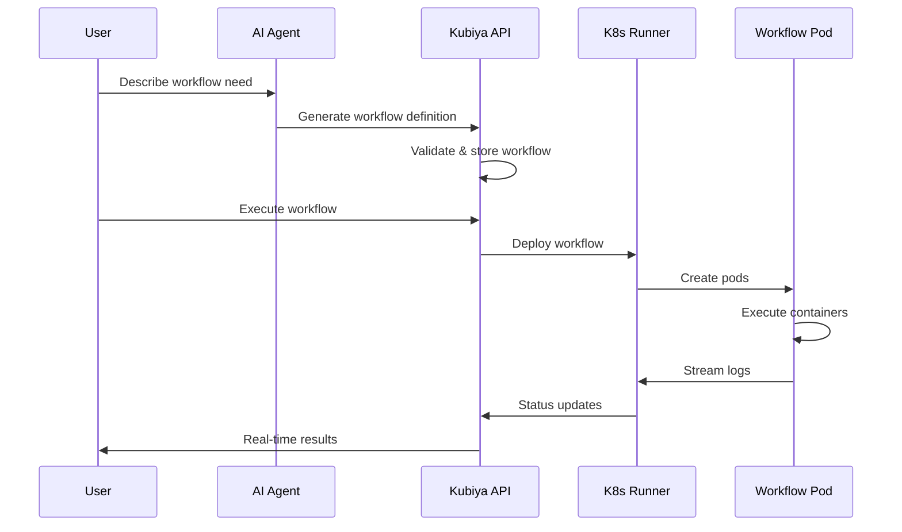

# Platform Overview

Kubiya is a comprehensive platform that brings together AI intelligence and infrastructure automation. At its core, Kubiya enables AI agents to generate and execute complex workflows on your infrastructure securely and reliably.

## Core Components

### 1. Kubiya Platform

The central control plane that manages:
- **Workflow Registry**: Stores and versions workflow definitions
- **Agent Service**: Connects to AI providers for intelligent automation
- **API Gateway**: RESTful and streaming APIs for all operations
- **Security & Auth**: RBAC, audit logs, and credential management

### 2. Kubiya Runners

Kubernetes operators that execute workflows in your infrastructure:
- **Local Runners**: Deploy in your K8s clusters
- **Hosted Runners**: Managed by Kubiya for quick starts
- **Hybrid Mode**: Mix local and hosted for flexibility

### 3. Workflow Engine

The execution engine that:
- Parses workflow DAGs
- Schedules container execution
- Manages state and retries
- Streams real-time logs

### 4. AI Integration Layer

Connects various AI providers:
- **Google ADK**: Agent Development Kit integration
- **Anthropic Claude**: Via MCP protocol
- **OpenAI**: GPT models for workflow generation
- **Custom Models**: Bring your own LLMs

## Architecture Flow

## Key Differentiators

### Infrastructure-First Design

Unlike SaaS workflow tools, Kubiya runs entirely in your environment:

<ComparisonTable>
  <ComparisonRow>
    <ComparisonHeader>Feature</ComparisonHeader>
    <ComparisonHeader>Kubiya</ComparisonHeader>
    <ComparisonHeader>Traditional SaaS</ComparisonHeader>
  </ComparisonRow>
  <ComparisonRow>
    <ComparisonCell>Data Location</ComparisonCell>
    <ComparisonCell>✅ Stays in your infrastructure</ComparisonCell>
    <ComparisonCell>❌ Flows through vendor cloud</ComparisonCell>
  </ComparisonRow>
  <ComparisonRow>
    <ComparisonCell>Container Support</ComparisonCell>
    <ComparisonCell>✅ Any Docker image</ComparisonCell>
    <ComparisonCell>❌ Limited to vendor tools</ComparisonCell>
  </ComparisonRow>
  <ComparisonRow>
    <ComparisonCell>Network Access</ComparisonCell>
    <ComparisonCell>✅ Direct access to internal resources</ComparisonCell>
    <ComparisonCell>❌ Requires VPN/tunnels</ComparisonCell>
  </ComparisonRow>
  <ComparisonRow>
    <ComparisonCell>Compliance</ComparisonCell>
    <ComparisonCell>✅ Full control for compliance</ComparisonCell>
    <ComparisonCell>❌ Shared responsibility model</ComparisonCell>
  </ComparisonRow>
</ComparisonTable>

### AI-Native Workflow Generation

Kubiya is built from the ground up for AI agents:

1. **Natural Language to DAG**: AI agents understand intent and generate structured workflows
2. **Context Awareness**: Agents have access to your tools, integrations, and patterns
3. **Learning Loop**: Workflows improve based on execution feedback
4. **Multi-Agent Coordination**: Different AI models for different tasks

### Enterprise-Grade Security

Security is built into every layer:

- **Zero Trust**: Runners authenticate with mutual TLS
- **RBAC**: Fine-grained permissions for users and agents
- **Audit Logging**: Complete trail of all operations
- **Secrets Management**: Integration with K8s secrets, Vault, etc.
- **Network Policies**: Runners respect your K8s network policies

## Platform Capabilities

### Workflow Orchestration

- **DAG Execution**: Complex dependency graphs
- **Parallel Execution**: Run steps concurrently
- **Conditional Logic**: If/else branches
- **Loops & Iterations**: For/while constructs
- **Error Handling**: Retries, fallbacks, compensations

### Container Management

- **Any Image**: Public or private registries
- **Resource Limits**: CPU, memory, GPU allocation
- **Volume Mounts**: Persistent and ephemeral storage
- **Environment Variables**: Secure injection
- **Network Policies**: Control container networking

### Integration Ecosystem

<CardGroup cols={3}>
  <Card title="Source Control" icon="code-branch">
    Git, GitHub, GitLab, Bitbucket
  </Card>
  <Card title="CI/CD" icon="infinity">
    Jenkins, CircleCI, GitHub Actions
  </Card>
  <Card title="Cloud Providers" icon="cloud">
    AWS, GCP, Azure, Private clouds
  </Card>
  <Card title="Databases" icon="database">
    PostgreSQL, MySQL, MongoDB, Redis
  </Card>
  <Card title="Messaging" icon="message">
    Kafka, RabbitMQ, SQS, Pub/Sub
  </Card>
  <Card title="Monitoring" icon="chart-line">
    Prometheus, Grafana, DataDog
  </Card>
</CardGroup>

### Observability

Built-in monitoring and debugging:

- **Real-time Logs**: Stream from all containers
- **Metrics**: Execution time, resource usage
- **Tracing**: Distributed tracing support
- **Debugging**: Step-through execution
- **Alerting**: Integration with your alerting stack

## Use Cases

### DevOps Automation
- CI/CD pipelines
- Infrastructure provisioning
- Deployment automation
- Incident response

### Data Engineering
- ETL/ELT pipelines
- Data quality checks
- ML model training
- Batch processing

### Security Operations
- Vulnerability scanning
- Compliance checks
- Incident investigation
- Automated remediation

### Business Automation
- Report generation
- Data synchronization
- Notification workflows
- Integration workflows

## Getting Started

Ready to explore Kubiya? Check out these resources:

<CardGroup cols={2}>
  <Card title="Workflows Guide" icon="sitemap" href="/concepts/workflows">
    Learn about workflow architecture
  </Card>
  <Card title="Runners Guide" icon="server" href="/concepts/runners">
    Deploy runners in your infrastructure
  </Card>
  <Card title="Quick Start" icon="rocket" href="/getting-started/quickstart">
    Build your first workflow
  </Card>
  <Card title="API Reference" icon="code" href="/api-reference/overview">
    Explore the platform APIs
  </Card>
</CardGroup> 