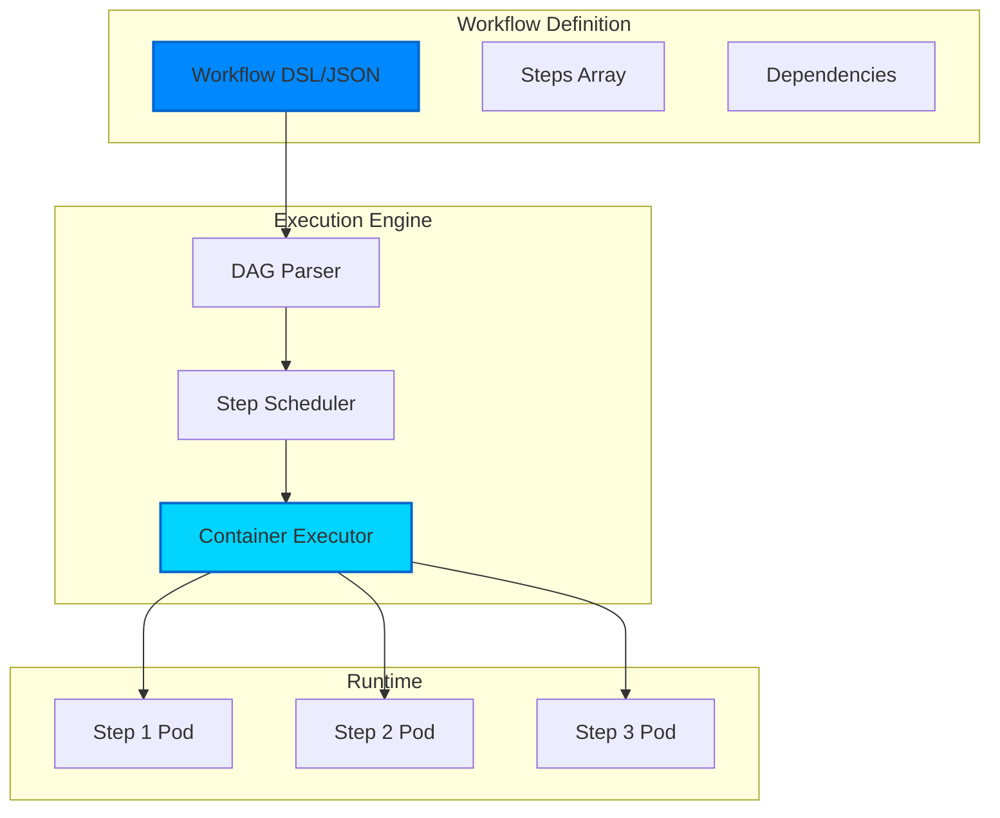
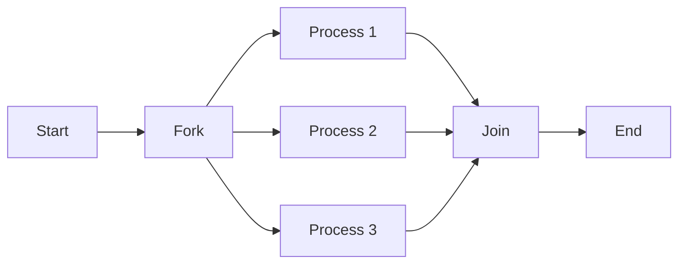
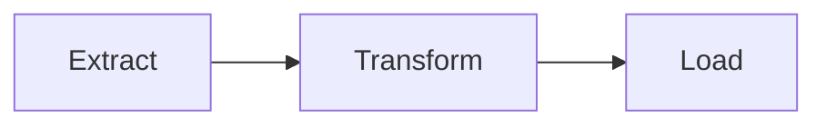
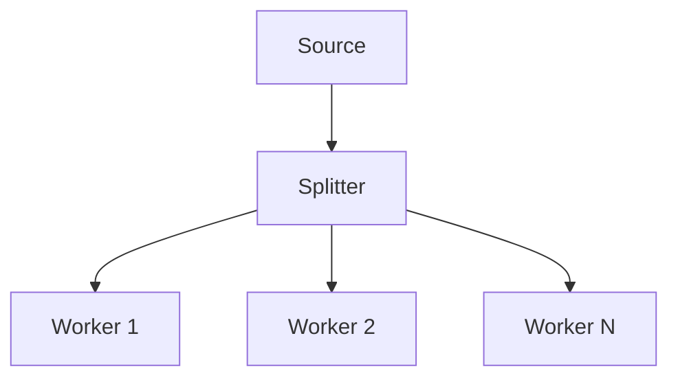

# Workflows

Workflows are the heart of Kubiya - they define sequences of containerized tasks that execute reliably on your infrastructure. Built on the concept of Directed Acyclic Graphs (DAGs), workflows provide deterministic execution with full observability.

<Note>
  **Key Insight**: Every workflow step runs as an independent Docker container. This means you can use ANY language, tool, or software - not just Python. Each execution starts fresh with zero state pollution.
</Note>

## What is a Workflow?

A workflow in Kubiya is:
- A **DAG** (Directed Acyclic Graph) of steps
- Each step runs in its own **Docker container** (serverless execution)
- **Language agnostic** - use Python, Node.js, Go, Rust, or any tool
- Steps can have **dependencies** on other steps
- Execution is **deterministic** and **reproducible**
- Fully **observable** with logs and metrics
- **Stateless** - no pollution between executions

## 🐳 The Container Revolution

Unlike traditional workflow engines that run scripts in a shared Python environment, Kubiya executes every step as a serverless container:

```python
# This workflow uses multiple languages and tools
from kubiya_workflow_sdk.dsl import workflow

wf = (
    workflow("multi-language-pipeline")
    .step("extract", callback=lambda step:
        step.docker(
            image="python:3.11",
            content="import pandas as pd; df = pd.read_csv('data.csv')"
        )
    )
    .step("transform", callback=lambda step:
        step.docker(
            image="node:20",
            content="const data = require('./data.json'); /* Node.js processing */"
        )
    )
    .step("analyze", callback=lambda step:
        step.docker(
            image="r-base:latest",
            content="library(ggplot2); # R statistical analysis"
        )
    )
    .step("deploy", callback=lambda step:
          step.docker(
            image="hashicorp/terraform:latest",
            command="terraform apply -auto-approve"
        )
    )
)
```

## Workflow Architecture



## Core Concepts

### Steps

The atomic unit of work in a workflow:

```python
from kubiya_workflow_sdk.dsl import Step

# Create a simple step object
step = Step("greet", "echo 'Hello, world!'")

# Shell command
shell_step = (
    Step(name="simple-command")
    .shell("grep \"TODO\" *.py | less")
    .shell_type("shell")
)

# Python script step
python_step = (
    Step(name="python-step")
    .script(
        """
            colors = ["red", "yellow", "green", "blue"]
            for color in colors:
                print(f"Color: {color}")
        """
    )
)

```

### Dependencies

Steps can depend on other steps, creating the DAG:

```python
from kubiya_workflow_sdk.dsl import Workflow

# An example of a multistep workflow. 3rd step depends on the output of the 2nd step.
wf = (
    Workflow("multistep-workflow")
    .step("initial-step", "echo 'This is the first step!'")
    .step("produce-data", callback = lambda s:
        s.shell("echo '7'")
          .output("RESULT_VAR")
    )
    .step("consume-data", callback = lambda s:
        s.depends("produce-data")
          .shell("echo $((RESULT_VAR+5))")
          .output("FINAL_RESULT")
    )
)

```

### Parallel Execution

Steps without dependencies run in parallel:

```python
from kubiya_workflow_sdk.dsl import workflow

wf = (
    workflow("parallel-pipeline")
    .parallel_steps(
        "deploy-regions",
        items=["us-east-1", "eu-west-1", "ap-south-1"],
        command="deploy-to-region.sh ${ITEM}",
        max_concurrent=2
    )
)

```

## Execution Model

### 1. Submission
When you submit a workflow:
- Workflow is validated for syntax and circular dependencies
- DAG is constructed from step dependencies
- Workflow is stored with a unique execution ID

### 2. Scheduling
The scheduler:
- Identifies steps ready to run (no pending dependencies)
- Allocates resources based on step requirements
- Queues steps for execution on available runners

### 3. Execution
For each step:
- Runner creates a Kubernetes pod
- Container image is pulled (with caching)
- Command is executed in the container
- Logs are streamed in real-time
- Exit code determines success/failure

### 4. State Management
Throughout execution:
- Step states: pending → running → success/failed
- Workflow state reflects overall progress
- State is persisted for durability
- Failures trigger retry logic if configured

## Workflow Patterns

### Fork-Join Pattern


### Pipeline Pattern


### Fan-Out Pattern


## Monitoring & Observability

### Real-Time Logs
Stream logs from any step:
```python
client = Client()
for event in client.stream_logs(execution_id, step_name):
    print(event.message)
```

### Metrics
Track workflow performance:
- Execution duration
- Step success/failure rates
- Resource utilization
- Queue wait times

### Tracing
Distributed tracing support:
- OpenTelemetry integration
- Trace across workflows
- Identify bottlenecks

## Best Practices

### 1. Keep Steps Atomic
Each step should do one thing well:
```python
# Good: Atomic steps
step.download_data(...)
step.validate_data(...)
step.process_data(...)

# Bad: Monolithic step
step.download_validate_and_process(...)
```

### 2. Use Appropriate Images
Choose minimal, purpose-built images:
```python
# Good: Specific images
step.run_python(image="python:3.11-slim")
step.run_kubectl(image="bitnami/kubectl:latest")

# Bad: Heavy, general images
step.run_python(image="ubuntu:latest")  # Too heavy
```

### 3. Handle Failures Gracefully
Always plan for failure:
```python
# Add retries for network operations
step.api_call(retry={"limit": 3})

# Add timeouts for long-running operations
step.process(timeout="30m")

# Add cleanup steps
step.cleanup(always_run=True)
```

### 4. Parameterize Workflows
Make workflows reusable:
```python
@workflow
def deploy(env: str, version: str, replicas: int = 3):
    # Parameterized workflow
    step.deploy(
        env={"ENV": env, "VERSION": version},
        command=f"kubectl scale --replicas={replicas}"
    )
```

## Next Steps

<CardGroup cols={2}>
  <Card title="Python DSL" icon="python" href="/workflows/python-dsl">
    Deep dive into the Python DSL
  </Card>
  <Card title="Workflow Examples" icon="code" href="/workflows/examples">
    Real-world workflow examples
  </Card>
  <Card title="Runners" icon="server" href="/concepts/runners">
    Learn about workflow execution
  </Card>
  <Card title="API Reference" icon="book" href="/api-reference/workflows">
    Complete workflow API docs
  </Card>
</CardGroup> 