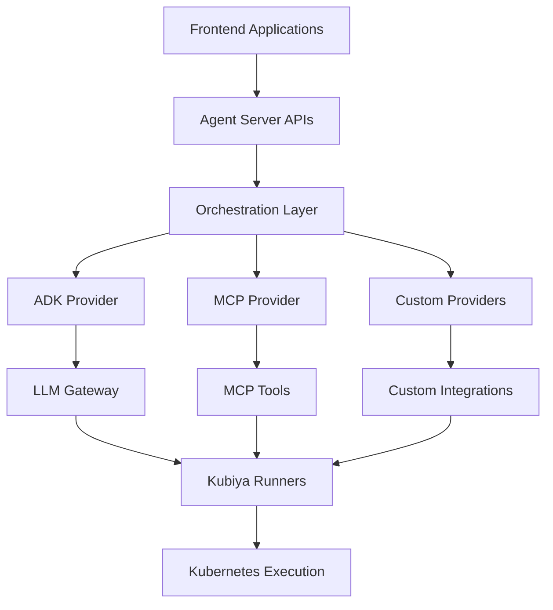

# Agent Servers

Agent servers are the backend orchestration layer that powers Kubiya's AI automation. They provide the computational foundation for AI agents to operate, whether hosted on Kubiya Cloud or deployed in your own infrastructure.

<Info>
**Agent Servers vs Providers**: Agent servers are the runtime environment, while providers (like ADK and MCP) are the implementations that give agent servers their specific capabilities.
</Info>

## Architecture Overview



## Deployment Options

<CardGroup cols={2}>
  <Card title="Kubiya Cloud" icon="cloud" color="#3b82f6">
    **Managed orchestration servers** with built-in LLM gateway access to multiple providers (OpenAI, Anthropic, Together AI, Google, etc.)
    
    - Zero infrastructure management
    - Automatic scaling and updates
    - Built-in multi-provider LLM access
    - Enterprise-grade security
  </Card>
  
  <Card title="Self-Hosted" icon="building" color="#10b981">
    **Deploy your own agent servers** using Docker, Kubernetes, or bare metal infrastructure
    
    - Full control over infrastructure
    - Custom security policies
    - Air-gapped deployments
    - Direct integration with internal systems
  </Card>
</CardGroup>

## Provider Ecosystem

Agent servers support multiple providers, each offering different capabilities:

### ADK (Agent Development Kit)
<Card title="ADK Provider" icon="robot" href="/full-stack-agents/agent-servers/adk">
  **AI-powered workflow generation** using natural language task descriptions
  
  - Natural language to workflow conversion
  - Multi-step task orchestration
  - Built-in LLM reasoning
  - Streaming execution updates
</Card>

### MCP (Model Context Protocol)
<Card title="MCP Provider" icon="plug" href="/full-stack-agents/agent-servers/fastmcp">
  **Tool-based agent interactions** through the Model Context Protocol standard
  
  - Standardized tool interfaces
  - Cross-platform compatibility
  - Extensible tool ecosystem
  - Community-driven development
</Card>

### Custom Providers
<Card title="Custom Providers" icon="gear">
  **Build specialized providers** for unique business requirements
  
  - Domain-specific logic
  - Proprietary integrations
  - Custom AI models
  - Specialized workflows
  
  See the [Provider Overview](/providers/overview) for implementation details.
</Card>

## Key Capabilities

<AccordionGroup>
  <Accordion title="🌊 Streaming & Real-time Updates" icon="wave">
    Agent servers provide real-time streaming of workflow execution, supporting both Server-Sent Events (SSE) and Vercel AI SDK formats for immediate frontend updates.
  </Accordion>
  
  <Accordion title="🔍 Discovery & Health Monitoring" icon="heart-pulse">
    Built-in discovery APIs allow automatic detection of server capabilities, while health monitoring ensures reliable operation across distributed deployments.
  </Accordion>
  
  <Accordion title="🔐 Security & Authentication" icon="shield-halved">
    Enterprise-grade security with UserKey authentication, role-based access control, and secure communication between components.
  </Accordion>
  
  <Accordion title="⚡ Multi-Provider Orchestration" icon="network-wired">
    Single servers can host multiple providers simultaneously, allowing complex workflows that combine ADK's AI generation with MCP's tool execution.
  </Accordion>
</AccordionGroup>

## Provider Selection Guide

Choose the right provider based on your use case:

<Tabs>
  <Tab title="AI-Powered Generation">
    **Use ADK Provider when:**
    - You need natural language task description
    - Workflows require AI reasoning and decision-making
    - Complex multi-step automation with branching logic
    - Dynamic workflow generation based on context
    
    ```python
    from kubiya_workflow_sdk.providers import get_provider
    
    adk = get_provider("adk")
    result = await adk.compose(
        task="Deploy app with health checks and rollback on failure",
        mode="act"
    )
    ```
  </Tab>
  
  <Tab title="Tool-Based Automation">
    **Use MCP Provider when:**
    - You have existing tools and want to connect them
    - Need standardized interfaces across different systems
    - Building on community-developed tools
    - Want maximum interoperability
    
    ```python
    from kubiya_workflow_sdk.providers import get_provider
    
    mcp = get_provider("mcp")
    result = await mcp.execute_tool(
        tool="database_query",
        parameters={"query": "SELECT * FROM users WHERE active = 1"}
    )
    ```
  </Tab>
  
  <Tab title="Custom Logic">
    **Use Custom Providers when:**
    - You need proprietary business logic
    - Integrating with legacy systems
    - Specific compliance or security requirements
    - Unique workflow patterns not covered by standard providers
    
    ```python
    from kubiya_workflow_sdk.providers import get_provider
    
    custom = get_provider("my_custom_provider")
    result = await custom.process(
        workflow_type="compliance_check",
        parameters={"system": "internal_audit"}
    )
    ```
  </Tab>
</Tabs>

## Multi-Provider Workflows

Agent servers can combine multiple providers in a single workflow:

<CodeGroup>
```python Multi-Provider Orchestration
from kubiya_workflow_sdk import workflow, step
from kubiya_workflow_sdk.providers import get_provider

@workflow
def hybrid_deployment():
    # Use ADK for AI-powered planning
    adk = get_provider("adk")
    plan = step("planning").adk_compose(
        task="Create deployment strategy for ${APP_NAME}",
        mode="plan"
    )
    
    # Use MCP for tool execution
    mcp = get_provider("mcp")
    deploy = step("execution").mcp_tool(
        tool="kubernetes_deploy",
        parameters={"strategy": "${plan.strategy}"}
    ).depends("planning")
    
    # Use custom provider for monitoring
    custom = get_provider("monitoring")
    monitor = step("monitoring").custom_action(
        action="setup_alerts",
        config={"deployment_id": "${deploy.id}"}
    ).depends("execution")
```

```yaml Provider Configuration
# agent-server.yaml
apiVersion: kubiya.ai/v1
kind: AgentServer
metadata:
  name: multi-provider-server
spec:
  providers:
    - name: adk
      type: adk
      config:
        llm_providers: ["openai", "anthropic"]
        streaming_enabled: true
        
    - name: mcp
      type: mcp
      config:
        tools_directory: "/var/lib/mcp/tools"
        auto_discovery: true
        
    - name: monitoring
      type: custom
      config:
        handler: "internal.monitoring.MonitoringProvider"
        
  resources:
    requests:
      cpu: "500m"
      memory: "1Gi"
    limits:
      cpu: "2000m"
      memory: "4Gi"
```
</CodeGroup>

## Production Deployment

### Scaling Considerations

<Warning>
**Resource Planning**: Agent servers with ADK providers require more computational resources due to LLM processing, while MCP providers are typically more lightweight and tool-focused.
</Warning>

### High Availability Setup

```yaml
# Multi-instance deployment for HA
apiVersion: apps/v1
kind: Deployment
metadata:
  name: agent-server-ha
spec:
  replicas: 3
  selector:
    matchLabels:
      app: agent-server
  template:
    metadata:
      labels:
        app: agent-server
    spec:
      containers:
      - name: agent-server
        image: kubiya/agent-server:latest
        env:
        - name: PROVIDERS
          value: "adk,mcp"
        - name: HA_MODE
          value: "true"
        resources:
          requests:
            cpu: 1000m
            memory: 2Gi
          limits:
            cpu: 4000m
            memory: 8Gi
```

## Next Steps

<CardGroup cols={3}>
  <Card title="ADK Provider" icon="robot" href="/providers/adk/getting-started">
    Set up AI-powered workflow generation
  </Card>
  <Card title="MCP Provider" icon="plug" href="/providers/fastmcp">
    Connect tools through Model Context Protocol
  </Card>
  <Card title="Provider Overview" icon="book" href="/providers/overview">
    Learn about the provider architecture
  </Card>
</CardGroup> 