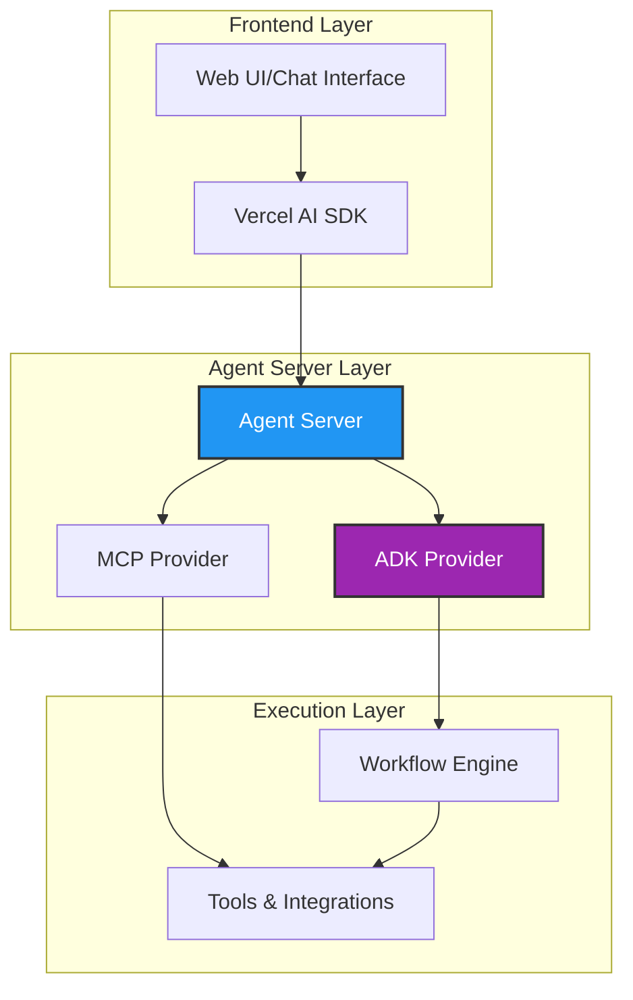

# Agent Servers & Providers

Kubiya provides a complete ecosystem for building AI-powered automation through agent servers and providers. This architecture enables you to create sophisticated AI workflows while maintaining deterministic execution.

## Architecture Overview

<CardGroup cols={2}>
  <Card title="Agent Servers" icon="server" href="/full-stack-agents/agent-servers">
    Backend orchestration servers that provide AI capabilities through standardized APIs
  </Card>
  <Card title="ADK Provider" icon="robot" href="/providers/adk/getting-started">
    Agent Development Kit for natural language workflow generation
  </Card>
  <Card title="MCP Providers" icon="plug" href="/mcp/overview">
    Model Context Protocol integration for tool connectivity
  </Card>
  <Card title="Frontend Integration" icon="browser" href="/frontend">
    Connect AI agents to web applications using modern frameworks
  </Card>
</CardGroup>

## How It Works



## Key Components

### 1. Agent Servers
Agent servers act as the orchestration layer that:
- Receive requests from frontend applications
- Route to appropriate providers (ADK, MCP, custom)
- Handle streaming responses
- Manage authentication and sessions

### 2. Providers

#### ADK (Agent Development Kit)
- **Purpose**: Generate workflows from natural language
- **Streaming**: Real-time workflow generation and execution
- **Models**: Supports multiple LLMs (GPT-4, Claude, Gemini)
- **Use Case**: "Deploy my app with health checks" → Complete workflow

#### FastMCP Provider
- **Purpose**: Connect to MCP-compatible tools
- **Protocol**: Model Context Protocol standard
- **Tools**: File system, GitHub, databases, etc.
- **Use Case**: Direct tool execution within workflows

### 3. Frontend Integration
- **Vercel AI SDK**: Stream AI responses to React applications
- **Real-time Updates**: WebSocket/SSE for live workflow execution
- **Universal Compatibility**: Works with any frontend framework

## Quick Start Examples

### Setting Up an Agent Server

```python
# 1. Install the SDK
pip install kubiya-workflow-sdk

# 2. Start ADK orchestration server
python -m kubiya_workflow_sdk.providers.adk.provider

# 3. Server runs on http://localhost:8001
```

### Using ADK Provider

```python
from kubiya_workflow_sdk.providers import get_provider

# Initialize ADK provider
adk = get_provider(
    "adk",
    api_key="YOUR_API_KEY",
    model="gemini-1.5-pro"
)

# Generate and execute workflow
result = await adk.compose(
    task="Create a backup of PostgreSQL database and upload to S3",
    mode="act",  # 'plan' to just generate, 'act' to execute
    stream=True
)

# Stream results
async for event in result:
    print(f"Event: {event}")
```

### Streaming with Frontend

```typescript
// Frontend using Vercel AI SDK
import { streamText } from 'ai';
import { kubiya } from '@kubiya/vercel-ai';

const { textStream } = await streamText({
  model: kubiya('http://localhost:8001'),
  prompt: 'Check system health and report issues',
});

// Display streaming results
for await (const text of textStream) {
  console.log(text);
}
```

## Provider Comparison

| Feature | ADK Provider | FastMCP Provider | Custom Provider |
|---------|--------------|------------------|-----------------|
| **Natural Language** | ✅ Workflow generation | ❌ Tool calls only | Depends |
| **Streaming** | ✅ Full support | ✅ Full support | Implement yourself |
| **Tools** | ✅ Any Docker tool | ✅ MCP tools | Your implementation |
| **Models** | Multiple LLMs | N/A | Your choice |
| **Use Case** | Complex workflows | Tool execution | Specialized needs |

## Best Practices

<AccordionGroup>
  <Accordion title="Use ADK for Complex Workflows" icon="brain">
    When you need to generate multi-step workflows from natural language, ADK is your best choice. It understands context and creates complete automation flows.
  </Accordion>
  
  <Accordion title="Use MCP for Direct Tool Access" icon="toolbox">
    For direct tool execution without workflow generation, MCP providers offer standardized access to various tools and services.
  </Accordion>
  
  <Accordion title="Enable Streaming for Better UX" icon="stream">
    Always enable streaming when building user-facing applications. Users see progress in real-time rather than waiting for complete execution.
  </Accordion>
  
  <Accordion title="Handle Errors Gracefully" icon="shield-exclamation">
    Implement proper error handling in your agent servers. Stream error events to the frontend for transparent user communication.
  </Accordion>
</AccordionGroup>

## Next Steps

<CardGroup cols={3}>
  <Card title="ADK Deep Dive" icon="robot" href="/providers/adk/getting-started">
    Master the Agent Development Kit
  </Card>
  <Card title="Streaming Guide" icon="stream" href="/providers/adk/streaming">
    Implement real-time streaming
  </Card>
  <Card title="Build Frontend" icon="browser" href="/frontend/vercel-ai-sdk">
    Create AI-powered UIs
  </Card>
</CardGroup> 