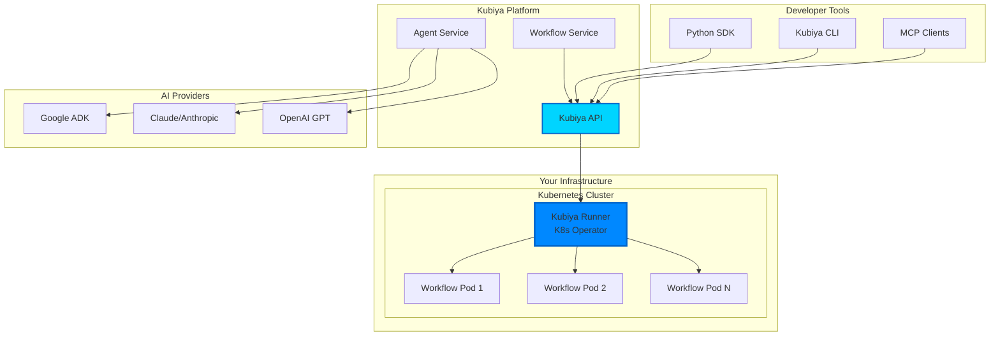

# Welcome to Kubiya

Kubiya is a platform that enables you to build, orchestrate, and execute intelligent workflows and AI agents directly on your infrastructure. It bridges the gap between AI capabilities and your existing systems, providing secure, scalable automation that runs where your data lives.

## What is Kubiya?

Kubiya provides a comprehensive platform for:

<CardGroup cols={2}>
  <Card title="Workflow Orchestration" icon="diagram-project" color="#0088ff">
    Build complex DAGs using simple Python DSL, orchestrate any container, and execute workflows durably on your infrastructure
  </Card>
  <Card title="AI Agent Integration" icon="robot" color="#0066cc">
    Connect AI agents from various providers (ADK, Claude, GPT) to execute real actions in your environment
  </Card>
  <Card title="Kubernetes Native" icon="dharmachakra" color="#00d4ff">
    Deploy runners as Kubernetes operators that securely orchestrate containers in your cluster
  </Card>
  <Card title="MCP Compatible" icon="plug" color="#0088ff">
    Integrate with Claude Desktop, Cursor, and other MCP-compatible tools for seamless AI assistance
  </Card>
</CardGroup>

## Why Kubiya?

### 🔒 **Runs on Your Infrastructure**
Unlike cloud-based solutions, Kubiya runners operate within your environment, ensuring data never leaves your control.

### 🚀 **Production-Ready Orchestration**
Built on Kubernetes operators, Kubiya provides enterprise-grade workflow execution with built-in durability, retries, and monitoring.

### 🤖 **AI-First Design**
Designed from the ground up to enable AI agents to build and execute complex workflows using natural language.

### 🔧 **Container Agnostic**
Orchestrate any container - from simple scripts to complex ML pipelines - using a unified DSL.

## Architecture Overview



## Key Features

### Workflow Definition
Define workflows using intuitive Python DSL:

```python
from kubiya import workflow, step

@workflow
def data_processing_pipeline():
    # Extract data from source
    raw_data = step.extract_data(
        image="myorg/data-extractor:latest",
        source="s3://bucket/data"
    )
    
    # Transform using Spark
    transformed = step.transform(
        image="apache/spark:3.4",
        input=raw_data,
        script="transform.py"
    )
    
    # Load to warehouse
    step.load_to_warehouse(
        image="myorg/loader:latest",
        data=transformed,
        target="snowflake"
    )
```

### AI-Powered Automation
Let AI agents build and execute workflows:

```python
# AI agents can generate workflows like this automatically
@workflow
def automated_deployment():
    # AI understands context and generates appropriate steps
    step.run_tests(image="node:18")
    step.build_image(dockerfile="./Dockerfile")
    step.deploy_to_k8s(manifest="./k8s/deployment.yaml")
    step.notify_team(channel="deployments")
```

### MCP Integration
Connect to any MCP-compatible client:

- **Claude Desktop**: Execute workflows directly from Claude
- **Cursor**: Build and run workflows from your IDE
- **Custom Agents**: Integrate your own AI agents via MCP protocol

## Getting Started

<Steps>
  <Step title="Install the SDK">
    Install Kubiya SDK to start building workflows
    ```bash
    pip install kubiya-workflow-sdk
    ```
  </Step>
  
  <Step title="Deploy a Runner">
    Deploy a Kubiya runner to your Kubernetes cluster
    ```bash
    kubectl apply -f https://get.kubiya.ai/runner.yaml
    ```
  </Step>
  
  <Step title="Create Your First Workflow">
    Build and execute your first workflow
    ```python
    from kubiya import workflow, step
    
    @workflow
    def hello_kubiya():
        step.echo("Hello from Kubiya!", image="alpine:latest")
    ```
  </Step>
</Steps>

## What's Next?

<CardGroup cols={3}>
  <Card title="Installation Guide" icon="download" href="/getting-started/installation">
    Set up Kubiya SDK and runners
  </Card>
  <Card title="Quick Start" icon="rocket" href="/getting-started/quickstart">
    Build your first workflow
  </Card>
  <Card title="Workflow Architecture" icon="sitemap" href="/workflows/architecture">
    Deep dive into how workflows run
  </Card>
</CardGroup>

## Join the Community

- 💬 [Discord](https://discord.gg/kubiya) - Chat with the team and community
- 🐛 [GitHub Issues](https://github.com/kubiya-sandbox/workflows/issues) - Report bugs and request features
- 🐦 [Twitter](https://x.com/kubiya_ai) - Stay updated with latest news
- 📧 [Email](mailto:support@kubiya.ai) - Contact our support team 