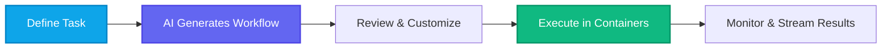

# Welcome to Kubiya Workflow SDK

<Info>
  The Kubiya Workflow SDK enables you to build, deploy, and manage intelligent automation workflows with ease. Whether you're automating DevOps tasks, creating AI-powered agents, or building complex integrations, our SDK provides the tools you need.
</Info>

## Quick Navigation

<CardGroup cols={2}>
  <Card
    title="Installation"
    icon="download"
    href="/getting-started/installation"
  >
    Get started with installing the SDK and setting up your environment
  </Card>
  <Card
    title="Quickstart Guide"
    icon="rocket"
    href="/getting-started/quickstart"
  >
    Build your first workflow in under 5 minutes
  </Card>
  <Card
    title="Core Concepts"
    icon="lightbulb"
    href="/concepts/platform-overview"
  >
    Understand the fundamental concepts behind Kubiya
  </Card>
  <Card
    title="SDK Reference"
    icon="code"
    href="/sdk/overview"
  >
    Explore the complete SDK documentation and API reference
  </Card>
</CardGroup>

## What is Kubiya?

<div className="hero">
  <h1 className="text-5xl font-bold mb-4">
    Kubiya Workflow SDK
  </h1>
  <p className="text-xl mb-8">
    The modern platform for building AI-powered automation workflows that seamlessly integrate with your entire tech stack
  </p>
  <div className="flex gap-4">
    <a href="/getting-started/quickstart" className="button primary-button px-6 py-3">
      Get Started →
    </a>
    <a href="https://github.com/kubiya-sandbox/workflows" className="button secondary-button px-6 py-3">
      View on GitHub
    </a>
  </div>
</div>

## 🚀 Why Kubiya?

<div className="feature-grid">
  <Card title="AI-Native Platform" icon="brain" color="#0EA5E9">
    Generate complex workflows using natural language. Our ADK provider uses cutting-edge LLMs to transform your requirements into production-ready automation.
  </Card>
  
  <Card title="Universal Integration" icon="plug" color="#6366F1">
    Connect anything: containers, APIs, databases, cloud services, AI models. If it has an interface, Kubiya can orchestrate it.
  </Card>
  
  <Card title="Deterministic Execution" icon="shield-check" color="#10B981">
    Unlike agent frameworks that wander, Kubiya provides rails for AI. Every workflow step runs in isolated containers with defined boundaries.
  </Card>
</div>

## 💡 Key Features

<Tabs>
  <Tab title="🤖 AI Workflow Generation">
    ```python
    from kubiya_workflow_sdk.providers import get_provider
    
    # Generate workflows with AI
    adk = get_provider("adk")
    result = await adk.compose(
        task="Create a zero-downtime deployment pipeline with health checks",
        mode="act"  # Instantly execute!
    )
    ```
  </Tab>
  
  <Tab title="🔧 Simple DSL">
    ```python
    from kubiya_workflow_sdk import workflow, step
    
    @workflow
    def deploy_app():
        # Every step runs in its own container
        build = step("build").docker(
            image="docker:latest",
            command="docker build -t myapp:latest ."
        )
        
        test = step("test").docker(
            image="myapp:latest",
            command="pytest tests/"
        ).depends("build")
        
        deploy = step("deploy").docker(
            image="kubectl:latest",
            command="kubectl apply -f k8s/"
        ).depends("test")
    ```
  </Tab>
  
  <Tab title="🧠 Intelligent Agents">
    ```python
    @workflow
    def smart_incident_response():
        # Embed AI decision-making in workflows
        analyze = step("analyze").inline_agent(
            message="Analyze these system metrics: ${METRICS}",
            agent_name="sre-expert",
            ai_instructions="You are an expert SRE. Identify issues and recommend fixes.",
            runners=["kubiya-hosted"],
            llm_model="gpt-4o"
        )
        
        # AI generates remediation scripts
        fix = step("auto-fix").inline_agent(
            message="Generate safe remediation for: ${ANALYSIS}",
            agent_name="remediation-expert",
            runners=["kubiya-hosted"]
        ).depends("analyze")
    ```
  </Tab>
</Tabs>

## 🎯 Common Use Cases

<CardGroup cols={3}>
  <Card title="CI/CD Pipelines" icon="code-branch">
    Build sophisticated deployment pipelines with canary releases, rollbacks, and health checks
  </Card>
  
  <Card title="Infrastructure Automation" icon="server">
    Provision and manage cloud resources across AWS, GCP, Azure with unified workflows
  </Card>
  
  <Card title="Incident Response" icon="bell">
    Automate runbooks with AI-powered analysis and remediation
  </Card>
  
  <Card title="Data Processing" icon="database">
    ETL pipelines that span multiple data sources and processing engines
  </Card>
  
  <Card title="Security Automation" icon="shield">
    Compliance checks, vulnerability scanning, and automated patching
  </Card>
  
  <Card title="ChatOps Integration" icon="message">
    Connect workflows to Slack, Teams, or AI assistants via MCP
  </Card>
</CardGroup>

## 📚 Quick Start

<Steps>
  <Step title="Install the SDK">
    ```bash
    pip install kubiya-workflow-sdk
    ```
  </Step>
  
  <Step title="Set your API key">
    ```bash
    export KUBIYA_API_KEY="your-api-key"
    ```
  </Step>
  
  <Step title="Create your first workflow">
    ```python
    from kubiya_workflow_sdk import workflow, step, run
    
    @workflow
    def hello_kubiya():
        step("greet").shell("echo 'Hello from Kubiya! 🚀'")
    
    # Run it!
    run(hello_kubiya)
    ```
  </Step>
</Steps>

## 🔗 Integration Ecosystem

<div className="grid grid-cols-2 md:grid-cols-4 gap-4 my-8">
  <div className="text-center p-4 border rounded-lg">
    <i className="fab fa-docker text-3xl text-blue-500 mb-2"></i>
    <p className="font-semibold">Docker</p>
  </div>
  <div className="text-center p-4 border rounded-lg">
    <i className="fab fa-kubernetes text-3xl text-blue-600 mb-2"></i>
    <p className="font-semibold">Kubernetes</p>
  </div>
  <div className="text-center p-4 border rounded-lg">
    <i className="fab fa-aws text-3xl text-orange-500 mb-2"></i>
    <p className="font-semibold">AWS</p>
  </div>
  <div className="text-center p-4 border rounded-lg">
    <i className="fab fa-google text-3xl text-blue-500 mb-2"></i>
    <p className="font-semibold">Google Cloud</p>
  </div>
  <div className="text-center p-4 border rounded-lg">
    <i className="fab fa-microsoft text-3xl text-blue-500 mb-2"></i>
    <p className="font-semibold">Azure</p>
  </div>
  <div className="text-center p-4 border rounded-lg">
    <i className="fab fa-github text-3xl text-gray-800 mb-2"></i>
    <p className="font-semibold">GitHub</p>
  </div>
  <div className="text-center p-4 border rounded-lg">
    <i className="fas fa-robot text-3xl text-green-500 mb-2"></i>
    <p className="font-semibold">OpenAI</p>
  </div>
  <div className="text-center p-4 border rounded-lg">
    <i className="fas fa-database text-3xl text-purple-500 mb-2"></i>
    <p className="font-semibold">Any Database</p>
  </div>
</div>

## 🛠️ How It Works



## 📖 Learn More

<CardGroup cols={2}>
  <Card title="Quick Start Guide" icon="play" href="/getting-started/quickstart">
    Get up and running in 5 minutes
  </Card>
  
  <Card title="Core Concepts" icon="book" href="/concepts/platform-overview">
    Understand Kubiya's architecture
  </Card>
  
  <Card title="Workflow Examples" icon="code" href="/workflows/examples">
    Explore real-world use cases
  </Card>
  
  <Card title="API Reference" icon="terminal" href="/api-reference/compose">
    Complete API documentation
  </Card>
</CardGroup>

## 🤝 Join the Community

<div className="flex gap-4 justify-center my-8">
  <a href="https://discord.gg/kubiya" className="flex items-center gap-2 px-4 py-2 border rounded-lg hover:bg-gray-50">
    <i className="fab fa-discord text-xl text-indigo-500"></i>
    <span>Discord</span>
  </a>
  <a href="https://github.com/kubiya-sandbox/workflows" className="flex items-center gap-2 px-4 py-2 border rounded-lg hover:bg-gray-50">
    <i className="fab fa-github text-xl"></i>
    <span>GitHub</span>
  </a>
  <a href="https://twitter.com/kubiya_ai" className="flex items-center gap-2 px-4 py-2 border rounded-lg hover:bg-gray-50">
    <i className="fab fa-twitter text-xl text-blue-400"></i>
    <span>Twitter</span>
  </a>
</div>

---

<Note>
  **Ready to revolutionize your automation?** [Get your API key](https://app.kubiya.ai) and start building intelligent workflows today!
</Note>

## Learning Path

Based on your goals, here are recommended learning paths:

### 🚀 For Developers
1. [Installation](/getting-started/installation) - Set up your development environment
2. [Quickstart](/getting-started/quickstart) - Build your first workflow
3. [Workflow DSL](/workflows/dsl-reference) - Master the workflow language
4. [Examples](/workflows/examples) - Learn from real-world examples

### 🤖 For AI/Automation Engineers
1. [Platform Overview](/concepts/platform-overview) - Understand the architecture
2. [ADK Getting Started](/providers/adk/getting-started) - Build AI agents
3. [Streaming](/providers/adk/streaming) - Implement real-time responses
4. [Agent Frameworks Comparison](/concepts/agent-frameworks-comparison) - Compare with other solutions

### 🏗️ For DevOps/Platform Engineers
1. [Runners](/concepts/runners) - Understand execution environments
2. [Integrations](/concepts/integrations) - Connect with your tools
3. [Deployment](/deployment/helm-chart) - Deploy to production
4. [API Reference](/api-reference/compose) - Integrate with your systems

## Need Help?

<CardGroup cols={2}>
  <Card
    title="Join our Discord"
    icon="discord"
    href="https://discord.gg/kubiya"
  >
    Connect with the community and get help from other developers
  </Card>
  <Card
    title="GitHub Issues"
    icon="github"
    href="https://github.com/kubiya-sandbox/workflows/issues"
  >
    Report bugs, request features, or contribute to the project
  </Card>
</CardGroup>

## What's Next?

Ready to get started? Head over to the [Installation Guide](/getting-started/installation) to set up the Kubiya Workflow SDK and begin building your first automation workflow! 