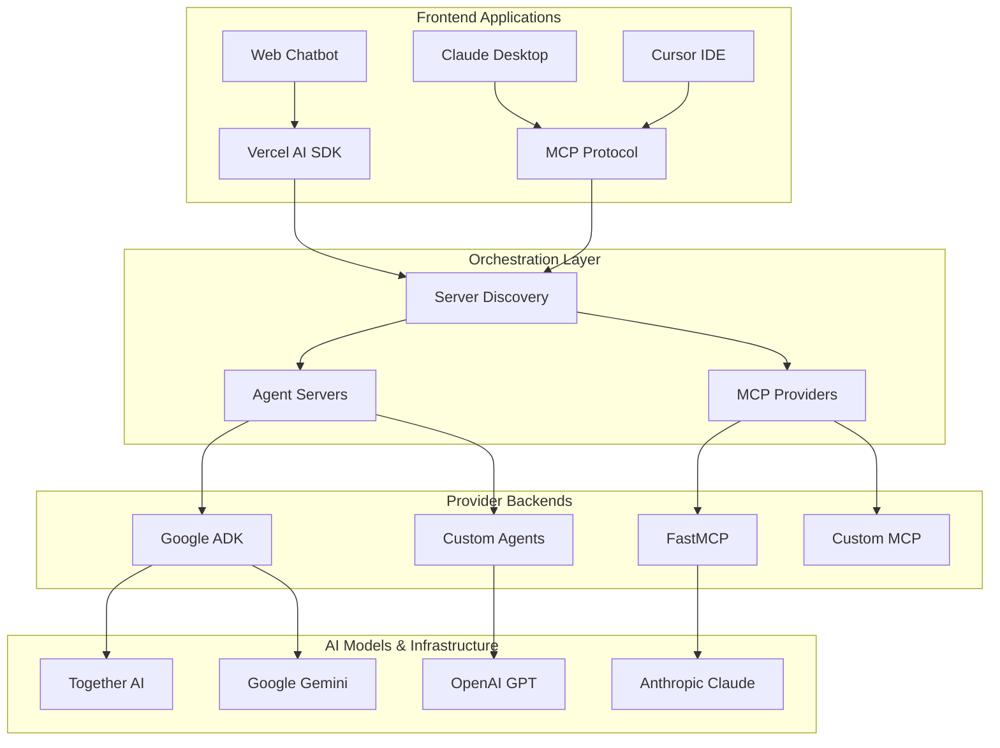

# Kubiya Workflow SDK Documentation

Build production-ready AI workflow systems that can understand, generate, and execute complex automation through natural language. From simple chatbots to enterprise orchestration platforms.

## 🚀 Quick Start

<CardGroup cols={2}>
  <Card title="⚡ 5-Minute Setup" href="/quick-start" icon="rocket">
    Get a working AI workflow system running in 5 minutes
  </Card>
  
  <Card title="📖 Learn the Basics" href="/providers/overview" icon="book">
    Understand the core concepts and architecture
  </Card>
</CardGroup>

---

## 🏗️ Architecture Overview

Kubiya provides a flexible architecture with multiple integration points:



---

## 📚 Core Documentation

### 🤖 Providers

<CardGroup cols={2}>
  <Card title="🔄 Providers Overview" href="/providers/overview" icon="layers">
    **Start here** - Understand Agent Servers vs MCP Providers
  </Card>
  
  <Card title="🏢 Agent Servers" href="/providers/agent-servers" icon="server">
    Full orchestration engines for complex workflows
  </Card>
  
  <Card title="🔌 MCP Providers" href="/providers/fastmcp" icon="plug">
    Model Context Protocol for AI assistant integration
  </Card>
  
  <Card title="⚙️ Google ADK" href="/providers/agent-servers/adk" icon="brain">
    Advanced multi-agent workflow generation
  </Card>
</CardGroup>

### 💻 Frontend Integration

<CardGroup cols={2}>
  <Card title="🌐 Frontend Overview" href="/frontend" icon="monitor">
    Modern web application integration patterns
  </Card>
  
  <Card title="⚡ Vercel AI SDK" href="/frontend/vercel-ai-sdk" icon="code">
    **Most Popular** - Build streaming AI chatbots
  </Card>
  
  <Card title="🖥️ Claude Desktop" href="/providers/fastmcp#claude-desktop-setup" icon="terminal">
    Connect Claude Desktop to your workflows
  </Card>
  
  <Card title="📝 Cursor IDE" href="/providers/fastmcp#cursor-ide-setup" icon="edit">
    Integrate with Cursor for AI-powered development
  </Card>
</CardGroup>

### 📖 Complete Tutorials

<CardGroup cols={1}>
  <Card title="🎯 Full-Stack AI Development" href="/tutorials/full-stack-ai" icon="graduation-cap">
    **Complete Guide** - From local development to production deployment with monitoring, CI/CD, and scaling
  </Card>
</CardGroup>

---

## 🛠️ Implementation Paths

Choose your implementation approach based on your needs:

### Path 1: Simple Chatbot (Recommended for beginners)
1. **[Quick Start](/quick-start)** - 5-minute setup
2. **[Vercel AI SDK Integration](/frontend/vercel-ai-sdk)** - Production chatbot
3. **[ADK Server Setup](/providers/agent-servers/adk)** - Advanced workflows

### Path 2: AI Assistant Integration
1. **[MCP Overview](/providers/fastmcp)** - Understand MCP protocol
2. **[Claude Desktop Setup](/providers/fastmcp#claude-desktop-setup)** - Connect Claude
3. **[Custom MCP Server](/providers/fastmcp#custom-mcp-server)** - Build your own

### Path 3: Enterprise Platform
1. **[Architecture Overview](/providers/overview)** - Understand the big picture
2. **[Multi-Server Setup](/frontend/vercel-ai-sdk#multiple-server-support)** - Load balancing
3. **[Production Deployment](/tutorials/full-stack-ai)** - Complete infrastructure

---

## 🎯 Use Cases

<CardGroup cols={3}>
  <Card title="🤖 AI Chatbots" icon="message-circle">
    Build intelligent chatbots that can execute workflows through natural language conversation
  </Card>
  
  <Card title="⚙️ DevOps Automation" icon="settings">
    Automate deployments, infrastructure management, and operational tasks
  </Card>
  
  <Card title="📊 Business Processes" icon="chart-bar">
    Streamline complex business workflows with AI-driven orchestration
  </Card>
  
  <Card title="🔧 Development Tools" icon="code">
    Integrate AI capabilities into IDEs and development environments
  </Card>
  
  <Card title="📈 Data Pipelines" icon="database">
    Orchestrate data processing and analytics workflows
  </Card>
  
  <Card title="🚀 CI/CD Pipelines" icon="git-branch">
    Intelligent build, test, and deployment automation
  </Card>
</CardGroup>

---

## 🏃‍♂️ Quick Examples

### Minimal ADK Server
```python
# workflow_sdk/adk_orchestration_server.py
from kubiya_workflow_sdk.providers.adk import ADKProvider
from fastapi import FastAPI

app = FastAPI()
adk_provider = ADKProvider()

@app.post("/compose")
async def compose(request):
    return adk_provider.compose(
        task=request.prompt,
        mode=request.mode
    )
```

### Simple Frontend Integration
```typescript
// app/api/chat/route.ts
import { streamText } from 'ai';

export async function POST(request) {
  const { messages, selectedServer } = await request.json();
  
  if (selectedServer) {
    // Execute workflow
    return fetch(`${serverUrl}/compose`, {
      method: 'POST',
      body: JSON.stringify({ messages })
    });
  }
  
  // Regular AI chat
  return streamText({ model: openai('gpt-4'), messages });
}
```

### MCP Integration
```python
# fastmcp_server.py
from kubiya_workflow_sdk.providers.fastmcp import FastMCPProvider

@mcp.tool()
def execute_workflow(prompt: str):
    return provider.compose(task=prompt, mode="act")
```

---

## 🔗 Key Features

<AccordionGroup>
  <Accordion title="🧠 Intelligent Workflow Generation">
    - **Multi-agent orchestration** with Google ADK
    - **Natural language** to executable workflows
    - **Context-aware** workflow planning and refinement
    - **Real-time streaming** of generation process
  </Accordion>

  <Accordion title="🔌 Universal Integration">
    - **Vercel AI SDK** for modern web applications  
    - **Model Context Protocol** for AI assistants
    - **Server discovery** for automatic configuration
    - **Multi-provider** support (ADK, MCP, custom)
  </Accordion>

  <Accordion title="⚡ Production Ready">
    - **Streaming responses** with SSE
    - **Error handling** and retry logic
    - **Health monitoring** and observability
    - **Docker deployment** configurations
  </Accordion>

  <Accordion title="🛡️ Enterprise Features">
    - **Authentication** and authorization
    - **Multi-tenant** support
    - **Rate limiting** and quotas
    - **Audit logging** and compliance
  </Accordion>
</AccordionGroup>

---

## 📋 Prerequisites

- **Python 3.10+** with virtual environment
- **Node.js 18+** for frontend applications
- **API Keys**: Kubiya, Together AI, OpenAI, or Anthropic
- **Optional**: Docker for containerized deployment

---

## 🆘 Support & Community

<CardGroup cols={2}>
  <Card title="📖 Documentation" href="https://docs.kubiya.ai" icon="book">
    Complete API reference and guides
  </Card>
  
  <Card title="💬 Discord Community" href="https://discord.gg/kubiya" icon="message-circle">
    Get help from the community
  </Card>
  
  <Card title="🐛 GitHub Issues" href="https://github.com/kubiya-ai/workflow-sdk/issues" icon="bug">
    Report bugs and request features
  </Card>
  
  <Card title="📧 Enterprise Support" href="mailto:support@kubiya.ai" icon="mail">
    Commercial support and consulting
  </Card>
</CardGroup>

---

## 🚀 What's Next?

<Steps>
  <Step title="Choose Your Path">
    Pick one of the implementation paths above based on your needs
  </Step>
  
  <Step title="Follow the Guide">
    Use our step-by-step tutorials with working code examples
  </Step>
  
  <Step title="Deploy to Production">
    Scale up with our production deployment guides
  </Step>
  
  <Step title="Join the Community">
    Share your results and get help from other developers
  </Step>
</Steps>

---

**Ready to get started?** 👉 **[Begin with the 5-minute Quick Start →](/quick-start)** 