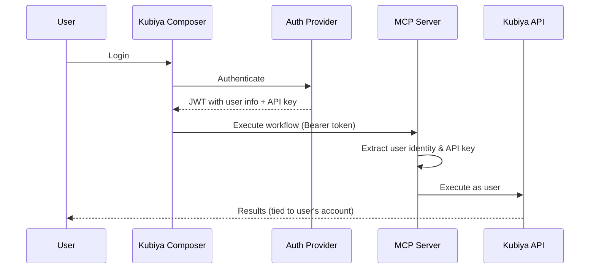

# MCP Authentication

The Kubiya MCP server supports multiple authentication methods to secure your workflows and protect API access.

## Why Authentication Matters

The MCP authentication system serves a critical purpose: **identity delegation**. When users interact with Kubiya through various interfaces (Composer UI, API, CLI), the MCP server ensures that:

1. **User Identity is Preserved** - The authenticated user's identity flows through to workflow execution
2. **Workflows Run on User's Behalf** - All actions are performed with the user's permissions and API key
3. **Audit Trail is Maintained** - Every workflow execution is tied to the user who initiated it
4. **Multi-tenant Security** - Different users can safely share the same MCP server with isolated execution contexts

## How Identity Delegation Works



When a user accesses Kubiya through the Composer UI or any other interface:
1. They authenticate with your organization's identity provider
2. The identity provider issues a JWT containing the user's identity AND their Kubiya API key
3. This JWT is passed to the MCP server with each request
4. The MCP server extracts the user's API key and executes workflows on their behalf
5. All workflow executions are tied to the authenticated user in Kubiya's audit logs

## Authentication Methods

### 1. Simple API Key (Default)

The simplest approach - pass your Kubiya API key directly:

```python
# Method 1: As a parameter
result = await execute_tool.ainvoke({
    "name": "my-workflow",
    "params": {"env": "production"},
    "api_key": "your-kubiya-api-key"
})

# Method 2: Environment variable
export KUBIYA_API_KEY="your-api-key"
```

This approach works well for:
- Development and testing
- Simple integrations
- Single-user scenarios

⚠️ **Note**: With this method, all workflows execute with the same identity (the API key owner).

### 2. OAuth/OIDC Authentication (Production)

For production deployments, use OAuth 2.0 or OpenID Connect authentication with the `mcpauth` library. This enables proper user identity delegation.

## Setting Up OAuth/OIDC Authentication

### Installation

```bash
pip install kubiya-workflow-sdk[auth]
# or
pip install mcpauth
```

### Basic Configuration

```python
from kubiya_workflow_sdk.mcp.server_auth import create_mcp_server_auth

# Create server with OIDC authentication
server = create_mcp_server_auth(
    name="Kubiya MCP Server",
    auth_server_url="https://your-auth-server.com",
    auth_server_type="oidc",  # or "oauth"
    required_scopes=["read", "write", "execute"]
)

# Run the server
app = server.create_app()
```

### Running with Authentication

```bash
# With command line arguments
python -m kubiya_workflow_sdk.mcp.server_auth \
  --auth-server https://your-auth-server.com \
  --auth-type oidc \
  --required-scopes read write execute

# Or with environment variables
export KUBIYA_AUTH_SERVER="https://your-auth-server.com"
python -m kubiya_workflow_sdk.mcp.server_auth
```

## Supported Auth Providers

The MCP server works with any OAuth 2.0 or OpenID Connect provider:

### Popular Providers

- **Auth0**: Full OIDC support
- **Okta**: Enterprise SSO
- **Google**: Google Workspace integration
- **Microsoft Azure AD**: Enterprise Microsoft integration
- **Keycloak**: Open-source identity management

### Provider Configuration

Each provider needs to support:
- OAuth 2.0 Authorization Server Metadata (RFC 8414)
- OpenID Connect Discovery (for OIDC)
- JWT tokens with standard claims

## API Key in JWT Claims

When using OAuth/OIDC, include the Kubiya API key in JWT claims:

### Standard Locations

The server checks these claim locations:
1. `kubiya_api_key` - Custom claim
2. `api_key` - Generic API key claim
3. `metadata.kubiya_api_key` - Nested in metadata

### Example JWT Payload

```json
{
  "sub": "user123",
  "name": "John Doe",
  "email": "john@example.com",
  "scope": "read write execute",
  "kubiya_api_key": "kb-1234567890abcdef",
  "iat": 1677654321,
  "exp": 1677657921
}
```

## User-Specific API Keys

For proper identity delegation, each user should have their own Kubiya API key. This ensures:

1. **Individual Accountability** - Each action is traceable to a specific user
2. **Granular Permissions** - Different users can have different access levels
3. **Security Isolation** - Compromised keys affect only one user
4. **Usage Tracking** - Monitor and limit usage per user

### Setting Up User API Keys

1. **During User Onboarding**:
   ```javascript
   // In your identity provider's user creation flow
   const kubiyaApiKey = await kubiyaClient.createApiKey({
     userId: user.id,
     name: `${user.name} - MCP Access`,
     scopes: ['workflows:execute']
   });
   
   // Store in user's profile/claims
   user.metadata.kubiya_api_key = kubiyaApiKey;
   ```

2. **In JWT Token Claims**:
   ```javascript
   // When issuing JWT tokens
   const token = jwt.sign({
     sub: user.id,
     name: user.name,
     email: user.email,
     kubiya_api_key: user.metadata.kubiya_api_key,
     scope: "read write execute"
   }, privateKey);
   ```

## Scope-Based Authorization

Define required scopes for different operations:

```python
server = create_mcp_server_auth(
    auth_server_url="https://auth.example.com",
    required_scopes=["read", "write", "execute"]
)
```

### Common Scope Patterns

| Scope | Permissions |
|-------|------------|
| `read` | List and view workflows |
| `write` | Create and modify workflows |
| `execute` | Execute workflows |
| `admin` | Full access including deletion |

## Testing Authentication

### 1. Check Metadata Endpoint

```bash
curl http://localhost:8000/.well-known/oauth-authorization-server
```

### 2. Test with Bearer Token

```bash
# Get token from your auth provider
TOKEN="your-jwt-token"

# Make authenticated request
curl -H "Authorization: Bearer $TOKEN" \
  -H "Content-Type: application/json" \
  http://localhost:8000/
```

### 3. Using MCP Client

```python
from fastmcp.client import Client
from fastmcp.client.transports import StreamableHttpTransport

transport = StreamableHttpTransport(
    "http://localhost:8000/mcp",
    auth="your-jwt-token"  # JWT from auth provider
)

client = Client(transport)
```

## Security Best Practices

1. **Always use HTTPS** in production
2. **Rotate API keys** regularly
3. **Use short-lived JWT tokens** (1 hour or less)
4. **Implement proper scope restrictions**
5. **Monitor authentication logs**
6. **Use environment variables** for sensitive data
7. **Assign unique API keys** to each user
8. **Audit workflow executions** by user identity

## Troubleshooting

### "No API token provided" Error

The server couldn't find an API key. Check:
1. JWT claims include `kubiya_api_key`
2. Environment variable `KUBIYA_API_KEY` is set
3. API key parameter is passed correctly

### "Invalid token" Error

JWT validation failed. Verify:
1. Token hasn't expired
2. Token signature is valid
3. Required scopes are present
4. Auth server URL is correct

### "Insufficient permissions" Error

User lacks required scopes. Ensure:
1. JWT includes all required scopes
2. Auth provider grants necessary permissions
3. Scope names match exactly

## Migration Guide

### From Simple to OAuth

1. Install `mcpauth`: `pip install mcpauth`
2. Set up auth provider (Auth0, Okta, etc.)
3. Configure provider to include `kubiya_api_key` in claims
4. Update server startup to use `server_auth`
5. Update clients to obtain JWT tokens
6. Test thoroughly before switching production

## Next Steps

- [Configure your auth provider](/mcp/auth-providers)
- [Set up scope-based permissions](/mcp/authorization)
- [Monitor authentication events](/mcp/monitoring) 