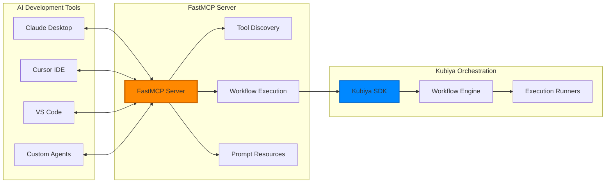

# FastMCP Provider

FastMCP is a native Python implementation of the Model Context Protocol (MCP) that enables seamless integration between Kubiya workflows and AI assistants like Claude Desktop, Cursor, and other MCP-compatible tools.

## What is FastMCP?

FastMCP provides a standardized way for AI assistants to discover, understand, and execute workflows through the Model Context Protocol. It acts as a bridge between your workflow orchestration systems and AI development tools.

### Key Benefits

<CardGroup cols={2}>
  <Card title="🤖 AI Assistant Integration" icon="robot">
    Connect Claude Desktop, Cursor, and other AI tools directly to your workflows
  </Card>
  
  <Card title="🔌 Protocol Standardization" icon="plug">
    Use the standard MCP protocol for consistent AI tool integration
  </Card>
  
  <Card title="🚀 Zero Configuration" icon="zap">
    Automatic tool discovery and capability exposure
  </Card>
  
  <Card title="🔄 Real-time Streaming" icon="refresh">
    Stream workflow execution progress back to AI assistants
  </Card>
</CardGroup>

## Architecture



## Installation & Setup

### Prerequisites

- **Python 3.10+**
- **FastMCP library** (automatically included in Kubiya SDK)
- **AI assistant** (Claude Desktop, Cursor, etc.)

### 1. Install Dependencies

```bash
# FastMCP is included with Kubiya SDK
pip install kubiya-workflow-sdk

# Or install FastMCP directly
pip install fastmcp
```

### 2. Configure FastMCP Provider

The FastMCP provider is automatically registered when you use the Kubiya SDK:

```python
# fastmcp_server.py
from kubiya_workflow_sdk.server.orchestration_server import create_orchestration_server
from kubiya_workflow_sdk.providers.fastmcp import FastMCPProvider

# Create FastMCP provider with workflow capabilities
fastmcp_provider = FastMCPProvider(
    name="Kubiya Workflows",
    description="Execute and manage Kubiya workflows via MCP",
    tools=[
        "workflow_execution",
        "status_monitoring", 
        "result_streaming"
    ]
)

# Create orchestration server with MCP support
server = create_orchestration_server(
    name="Kubiya MCP Server",
    provider=fastmcp_provider,
    port=8001,
    enable_mcp=True
)

if __name__ == "__main__":
    server.run()
```

### 3. Test MCP Capabilities

```bash
# Start the MCP server
python fastmcp_server.py

# Test MCP discovery
curl http://localhost:8001/discover

# Response includes MCP capabilities:
{
  "mcp_capabilities": {
    "available": true,
    "tools": ["execute_workflow", "get_status", "list_workflows"],
    "prompts": ["workflow_help", "troubleshooting"],
    "resources": ["workflow_definitions", "execution_logs"],
    "protocol_version": "2024-11-05"
  },
  "supported_protocols": ["orchestration", "mcp"]
}
```

## AI Assistant Integration

### Claude Desktop Setup

Configure Claude Desktop to connect to your FastMCP server:

```json
// ~/Library/Application Support/Claude/claude_desktop_config.json (macOS)
// %APPDATA%\Claude\claude_desktop_config.json (Windows)
{
  "mcpServers": {
    "kubiya-workflows": {
      "command": "python",
      "args": ["/path/to/your/fastmcp_server.py"],
      "env": {
        "KUBIYA_API_KEY": "your-api-key",
        "KUBIYA_ORG": "your-org"
      }
    }
  }
}
```

### Cursor IDE Setup

For Cursor IDE, add the MCP server configuration:

```json
// .cursor/mcp_servers.json
{
  "servers": [
    {
      "name": "kubiya-workflows",
      "transport": "http",
      "url": "http://localhost:8001/mcp",
      "capabilities": ["tools", "resources", "prompts"]
    }
  ]
}
```

### VS Code with MCP Extension

Install the MCP extension for VS Code and configure:

```json
// .vscode/settings.json
{
  "mcp.servers": [
    {
      "name": "Kubiya Workflows",
      "url": "http://localhost:8001/mcp",
      "authentication": {
        "type": "bearer",
        "token": "${env:KUBIYA_API_KEY}"
      }
    }
  ]
}
```

## MCP Tools & Capabilities

### Workflow Execution Tools

FastMCP automatically exposes these workflow tools to AI assistants:

```python
# Available MCP tools:

@mcp_tool
def execute_workflow(
    name: str, 
    parameters: dict = None,
    mode: str = "async"
) -> dict:
    """Execute a workflow by name with optional parameters"""
    # Implementation provided by FastMCP provider

@mcp_tool  
def get_workflow_status(execution_id: str) -> dict:
    """Get the current status of a workflow execution"""
    # Implementation provided by FastMCP provider

@mcp_tool
def list_available_workflows() -> list:
    """List all available workflows and their descriptions"""
    # Implementation provided by FastMCP provider

@mcp_tool
def cancel_workflow(execution_id: str) -> dict:
    """Cancel a running workflow execution"""
    # Implementation provided by FastMCP provider
```

### MCP Resources

FastMCP provides access to workflow-related resources:

```python
# Available MCP resources:

@mcp_resource("workflows://available")
def get_available_workflows():
    """Get list of all available workflows"""
    return [
        {
            "uri": f"workflows://{w.name}",
            "name": w.name,
            "description": w.description,
            "parameters": w.parameters
        }
        for w in workflow_registry.list_workflows()
    ]

@mcp_resource("executions://recent")
def get_recent_executions():
    """Get recent workflow executions"""
    return [
        {
            "uri": f"executions://{e.id}",
            "workflow": e.workflow_name,
            "status": e.status,
            "started_at": e.started_at
        }
        for e in execution_history.get_recent(limit=20)
    ]
```

### MCP Prompts

FastMCP includes helpful prompts for AI assistants:

```python
# Available MCP prompts:

@mcp_prompt("workflow-help")
def workflow_help_prompt(topic: str = "general"):
    """Generate help content for workflow operations"""
    return f"""
    # Workflow Help: {topic}
    
    Available operations:
    - execute_workflow(name, parameters) - Run a workflow
    - get_workflow_status(execution_id) - Check status
    - list_available_workflows() - See all workflows
    
    Example:
    execute_workflow("backup-database", {{"target": "production"}})
    """

@mcp_prompt("troubleshooting")
def troubleshooting_prompt(error_message: str):
    """Generate troubleshooting guidance for workflow errors"""
    return f"""
    # Troubleshooting Workflow Error
    
    Error: {error_message}
    
    Common solutions:
    1. Check parameter format and required fields
    2. Verify workflow permissions and access
    3. Review recent execution logs
    4. Check system resource availability
    """
```

## Usage Examples

### In Claude Desktop

Once configured, you can ask Claude to manage workflows:

```
User: "List all available workflows"

Claude: I'll check what workflows are available for you.

*Claude calls list_available_workflows() tool*

I found these workflows:
1. backup-database - Backup production database to S3
2. deploy-application - Deploy app to Kubernetes cluster  
3. data-pipeline - ETL pipeline for analytics data
4. security-scan - Run security scans on codebase

Which one would you like to execute?
```

```
User: "Execute the backup-database workflow for the production environment"

Claude: I'll start the database backup workflow for production.

*Claude calls execute_workflow("backup-database", {"environment": "production"})*

Workflow started successfully!
- Execution ID: exec_abc123
- Status: Running
- Started: 2024-01-15 10:30:00

I'll monitor the progress. The backup typically takes 5-10 minutes.
```

### In Cursor IDE

Cursor can use workflows for code-related tasks:

```
User: "Run a security scan on the current project"

Cursor: I'll execute a security scan workflow on your project.

*Cursor calls execute_workflow("security-scan", {"project_path": "/current/project"})*

Security scan initiated:
- Scanning for vulnerabilities
- Checking dependencies
- Analyzing code patterns

Results will be available in about 3 minutes.
```

### Programmatic Usage

You can also interact with the FastMCP server programmatically:

```python
import requests

# Execute workflow via HTTP
response = requests.post(
    "http://localhost:8001/mcp/tools/execute_workflow",
    json={
        "name": "data-pipeline",
        "parameters": {
            "source": "postgres://prod-db",
            "destination": "s3://analytics-bucket"
        }
    }
)

execution = response.json()
print(f"Started execution: {execution['execution_id']}")

# Monitor progress
status_response = requests.get(
    f"http://localhost:8001/mcp/tools/get_workflow_status",
    params={"execution_id": execution['execution_id']}
)

status = status_response.json()
print(f"Current status: {status['status']}")
```

## Custom MCP Server

Create a custom MCP server with specific workflow capabilities:

```python
# custom_mcp_server.py
from fastmcp import FastMCP
from kubiya_workflow_sdk import KubiyaClient

# Initialize FastMCP server
mcp = FastMCP("Kubiya Workflow Server")

# Initialize Kubiya client
kubiya = KubiyaClient(api_key="your-api-key")

@mcp.tool()
def deploy_application(
    app_name: str,
    version: str,
    environment: str = "staging"
) -> dict:
    """Deploy an application to specified environment"""
    
    # Create deployment workflow
    workflow_definition = {
        "name": f"deploy-{app_name}-{version}",
        "steps": [
            {
                "name": "build-image",
                "type": "docker_build",
                "source": f"./apps/{app_name}",
                "tag": f"{app_name}:{version}"
            },
            {
                "name": "push-image", 
                "type": "docker_push",
                "depends_on": ["build-image"]
            },
            {
                "name": "deploy-k8s",
                "type": "kubernetes_deploy",
                "environment": environment,
                "depends_on": ["push-image"]
            }
        ]
    }
    
    # Execute workflow
    execution = kubiya.execute_workflow(workflow_definition)
    
    return {
        "success": True,
        "execution_id": execution.id,
        "status": execution.status,
        "message": f"Deployment of {app_name} v{version} to {environment} started"
    }

@mcp.tool()
def get_deployment_status(execution_id: str) -> dict:
    """Get status of a deployment execution"""
    
    execution = kubiya.get_execution_status(execution_id)
    
    return {
        "execution_id": execution_id,
        "status": execution.status,
        "progress": execution.progress,
        "logs": execution.recent_logs,
        "estimated_completion": execution.estimated_completion
    }

@mcp.resource("deployments://recent")
async def recent_deployments():
    """Get recent deployment executions"""
    
    executions = kubiya.list_executions(
        type="deployment",
        limit=10,
        order_by="created_at DESC"
    )
    
    return [
        {
            "uri": f"deployments://{e.id}",
            "name": f"{e.workflow_name} - {e.created_at}",
            "mimeType": "application/json",
            "metadata": {
                "status": e.status,
                "environment": e.parameters.get("environment"),
                "duration": e.duration_seconds
            }
        }
        for e in executions
    ]

if __name__ == "__main__":
    mcp.run()
```

## Advanced Configuration

### Authentication & Security

```python
# Secure MCP server with authentication
from fastmcp import FastMCP
from fastmcp.auth import BearerAuth

mcp = FastMCP(
    "Secure Kubiya Server",
    auth=BearerAuth(token="your-secure-token")
)

# Configure CORS for web access
mcp.add_cors(
    origins=["https://your-domain.com"],
    methods=["GET", "POST"],
    headers=["Authorization", "Content-Type"]
)
```

### Custom Transport

```python
# Use SSE transport for real-time updates
mcp = FastMCP(
    "Streaming Kubiya Server",
    transport="sse",
    enable_streaming=True
)

@mcp.tool()
async def execute_with_streaming(workflow_name: str):
    """Execute workflow with real-time progress streaming"""
    
    async for event in kubiya.execute_workflow_stream(workflow_name):
        # Stream events back to MCP client
        yield {
            "type": event.type,
            "data": event.data,
            "timestamp": event.timestamp
        }
```

### Environment-Specific Configuration

```python
# Production configuration
import os

mcp = FastMCP(
    name="Production Kubiya MCP",
    host="0.0.0.0",
    port=int(os.getenv("PORT", 8001)),
    enable_cors=True,
    log_level="INFO"
)

# Add health check endpoint
@mcp.tool()
def health_check() -> dict:
    """Health check for monitoring"""
    return {
        "status": "healthy",
        "timestamp": datetime.utcnow().isoformat(),
        "version": "1.0.0"
    }
```

## Best Practices

### Tool Design

- **Clear Descriptions**: Write detailed tool descriptions for AI understanding
- **Parameter Validation**: Validate all input parameters thoroughly
- **Error Handling**: Provide helpful error messages and recovery suggestions
- **Async Operations**: Use async tools for long-running workflows

### Resource Management

- **Caching**: Cache frequently accessed workflow data
- **Rate Limiting**: Implement rate limiting for API protection
- **Resource Cleanup**: Clean up temporary resources after use
- **Monitoring**: Monitor tool usage and performance

### Security

- **Authentication**: Use proper authentication for production deployments
- **Authorization**: Implement role-based access control
- **Input Sanitization**: Sanitize all user inputs
- **Audit Logging**: Log all tool executions for audit trails

## Troubleshooting

### Common Issues

**MCP Server Not Detected**
```bash
# Check server is running
curl http://localhost:8001/mcp/capabilities

# Verify MCP protocol support
curl http://localhost:8001/discover | jq '.mcp_capabilities'
```

**Tool Execution Failures**
```python
# Add comprehensive error handling
@mcp.tool()
def robust_workflow_execution(workflow_name: str):
    try:
        result = kubiya.execute_workflow(workflow_name)
        return {"success": True, "result": result}
    except Exception as e:
        return {
            "success": False,
            "error": str(e),
            "troubleshooting": "Check workflow parameters and permissions"
        }
```

**Authentication Issues**
```bash
# Verify API key configuration
echo $KUBIYA_API_KEY

# Test authentication
curl -H "Authorization: Bearer $KUBIYA_API_KEY" \
  http://localhost:8001/mcp/tools/list_workflows
```

## Next Steps

<CardGroup cols={2}>
  <Card title="🚀 Frontend Integration" href="/frontend/vercel-ai-sdk" icon="code">
    Build web applications that consume MCP-enabled workflows
  </Card>
  
  <Card title="🤖 Agent Servers" href="/providers/agent-servers" icon="robot">
    Learn about full-featured orchestration with agent servers
  </Card>
  
  <Card title="📚 End-to-End Tutorial" href="/tutorials/mcp-integration" icon="book">
    Complete tutorial for MCP integration
  </Card>
  
  <Card title="🔧 Custom Tools" href="/tutorials/custom-mcp-tools" icon="wrench">
    Create custom MCP tools for specific use cases
  </Card>
</CardGroup>

## Resources

- [FastMCP Documentation](https://gofastmcp.com/)
- [Model Context Protocol Specification](https://modelcontextprotocol.io/)
- [Claude Desktop MCP Guide](https://docs.anthropic.com/claude/docs/mcp)
- [MCP GitHub Repository](https://github.com/modelcontextprotocol) 