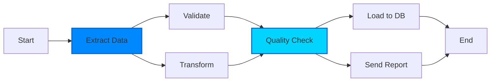
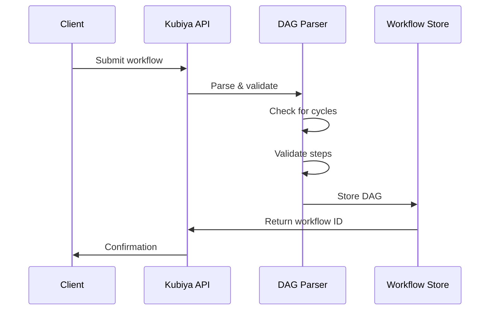
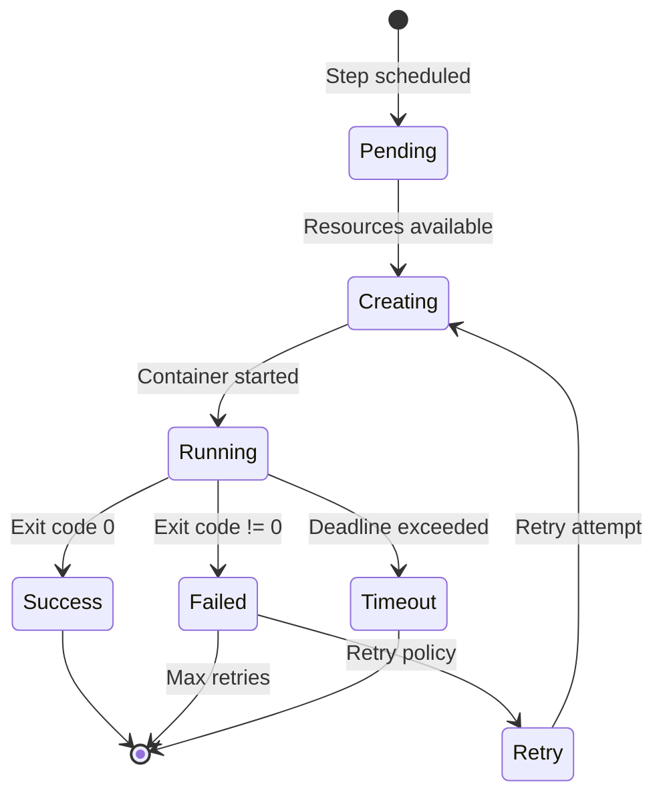
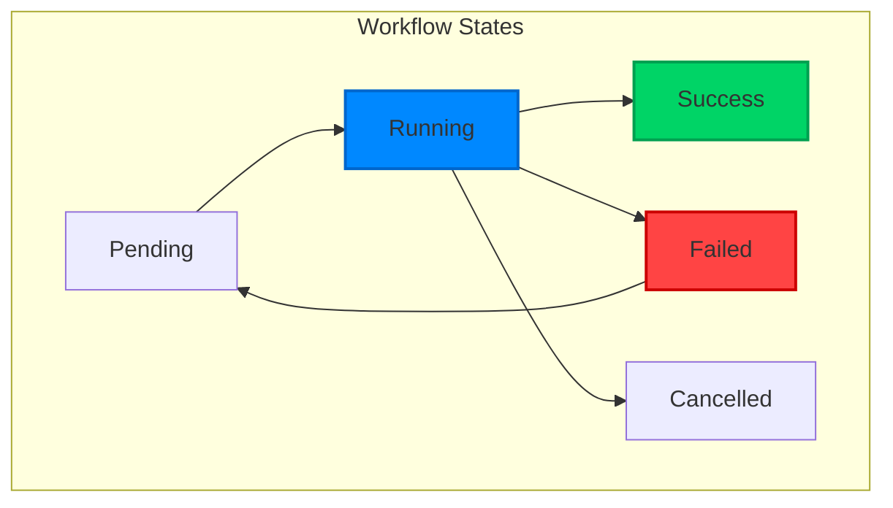

# Workflow Architecture

Kubiya's workflow architecture is built on the principles of Directed Acyclic Graphs (DAGs), container orchestration, and distributed execution. This page explores how workflows are structured, executed, and managed at scale.

## DAG Execution Model

### What is a DAG?

A Directed Acyclic Graph (DAG) is a collection of tasks organized with dependencies:
- **Directed**: Dependencies flow in one direction
- **Acyclic**: No circular dependencies allowed
- **Graph**: Tasks connected by dependency edges



### Why DAGs Matter

<CardGroup cols={2}>
  <Card title="Deterministic Execution" icon="route">
    Same input → Same execution path → Same output, every time
  </Card>
  <Card title="Parallel Processing" icon="layer-group">
    Independent tasks run simultaneously for optimal performance
  </Card>
  <Card title="Clear Dependencies" icon="diagram-project">
    Visual representation of task relationships and data flow
  </Card>
  <Card title="Fault Isolation" icon="shield">
    Failed tasks don't affect unrelated parts of the workflow
  </Card>
</CardGroup>

## Execution Lifecycle

### 1. Workflow Submission



### 2. DAG Scheduling

The scheduler determines execution order:

```python
class DAGScheduler:
    def get_ready_steps(self, dag, completed_steps):
        """Find steps ready to execute"""
        ready = []
        for step in dag.steps:
            if step.name in completed_steps:
                continue
            if all(dep in completed_steps for dep in step.dependencies):
                ready.append(step)
        return ready
```

### 3. Container Execution

Each step runs in an isolated container:

```yaml
apiVersion: batch/v1
kind: Job
metadata:
  name: workflow-${workflow_id}-step-${step_name}
  labels:
    kubiya.ai/workflow-id: ${workflow_id}
    kubiya.ai/step-name: ${step_name}
spec:
  template:
    spec:
      containers:
      - name: executor
        image: ${step.image}
        command: ${step.command}
        env:
        - name: WORKFLOW_ID
          value: ${workflow_id}
        - name: STEP_NAME
          value: ${step_name}
        resources:
          requests:
            memory: ${step.resources.memory}
            cpu: ${step.resources.cpu}
          limits:
            memory: ${step.resources.memory_limit}
            cpu: ${step.resources.cpu_limit}
      restartPolicy: OnFailure
      activeDeadlineSeconds: ${step.timeout_seconds}
```

## Container Orchestration

### Pod Lifecycle Management



### Resource Management

Kubiya ensures efficient resource utilization:

```python
@workflow
def resource_optimized_pipeline():
    # Light task - minimal resources
    step.validate_input(
        image="alpine:latest",
        resources={"cpu": "100m", "memory": "128Mi"}
    )
    
    # CPU-intensive task
    step.process_data(
        image="processor:latest",
        resources={"cpu": "4", "memory": "2Gi"}
    )
    
    # Memory-intensive task
    step.analyze_results(
        image="analyzer:latest",
        resources={"cpu": "1", "memory": "8Gi"}
    )
    
    # GPU task
    step.ml_inference(
        image="tensorflow:gpu",
        resources={
            "nvidia.com/gpu": "1",
            "memory": "16Gi"
        }
    )
```

### Volume Management

Share data between steps efficiently:

```python
@workflow
def data_pipeline():
    # Create shared volume
    data_volume = Volume("pipeline-data", size="10Gi")
    
    # Step 1: Download data to volume
    step.download(
        image="downloader:latest",
        volumes=[VolumeMount(data_volume, "/data")]
    )
    
    # Step 2 & 3: Process in parallel
    step.process_a(
        image="processor-a:latest",
        volumes=[VolumeMount(data_volume, "/data", read_only=True)],
        depends_on=["download"]
    )
    
    step.process_b(
        image="processor-b:latest",
        volumes=[VolumeMount(data_volume, "/data", read_only=True)],
        depends_on=["download"]
    )
    
    # Step 4: Merge results
    step.merge(
        image="merger:latest",
        volumes=[VolumeMount(data_volume, "/data")],
        depends_on=["process_a", "process_b"]
    )
```

## State Management

### Workflow States



### Persistence & Recovery

Kubiya maintains workflow state for durability:

```python
class WorkflowState:
    def __init__(self, workflow_id):
        self.workflow_id = workflow_id
        self.steps = {}
        self.status = "pending"
        self.started_at = None
        self.completed_at = None
    
    def update_step(self, step_name, status, output=None):
        self.steps[step_name] = {
            "status": status,
            "output": output,
            "updated_at": datetime.now()
        }
        self._persist()
    
    def _persist(self):
        # Save to persistent storage
        # Enables recovery after runner restart
        pass
```

## Advanced Execution Patterns

### Dynamic DAG Generation

Generate workflow steps dynamically:

```python
@workflow
def dynamic_processing():
    # Get list of items to process
    items = step.list_items(
        image="lister:latest",
        output_format="json"
    )
    
    # Dynamically create processing steps
    process_steps = []
    for item in items.output:
        step_name = f"process_{item['id']}"
        process_steps.append(
            step.create(
                name=step_name,
                image="processor:latest",
                env={"ITEM_ID": item['id']},
                depends_on=["list_items"]
            )
        )
    
    # Wait for all processing
    step.aggregate(
        image="aggregator:latest",
        depends_on=[s.name for s in process_steps]
    )
```

### Conditional Branching

Execute different paths based on conditions:

```python
@workflow
def conditional_deployment():
    # Run tests
    test_result = step.test(
        image="tester:latest",
        output_format="json"
    )
    
    # Branch based on test results
    if test_result.output["coverage"] > 80:
        # High coverage - deploy to production
        step.deploy_prod(
            image="deployer:latest",
            env={"TARGET": "production"}
        )
    else:
        # Low coverage - deploy to staging only
        step.deploy_staging(
            image="deployer:latest",
            env={"TARGET": "staging"}
        )
        
        # Notify team
        step.notify(
            image="notifier:latest",
            env={"MESSAGE": "Low coverage, staging only"}
        )
```

### Map-Reduce Pattern

Process large datasets efficiently:

```python
@workflow
def map_reduce_analysis():
    # Split data into chunks
    chunks = step.split_data(
        image="splitter:latest",
        env={"CHUNK_SIZE": "1GB"},
        output_format="json"
    )
    
    # Map: Process each chunk in parallel
    map_results = []
    for i, chunk in enumerate(chunks.output["chunks"]):
        result = step.map_process(
            name=f"map_{i}",
            image="mapper:latest",
            env={"CHUNK_PATH": chunk["path"]},
            depends_on=["split_data"]
        )
        map_results.append(result)
    
    # Reduce: Combine results
    step.reduce(
        image="reducer:latest",
        env={"RESULT_COUNT": str(len(map_results))},
        depends_on=[r.name for r in map_results]
    )
```

## Performance Optimization

### Parallel Execution

Maximize parallelism in your workflows:

```python
@workflow
def optimized_pipeline():
    # These run in parallel
    data1 = step.fetch_dataset1(image="fetcher:latest")
    data2 = step.fetch_dataset2(image="fetcher:latest")
    data3 = step.fetch_dataset3(image="fetcher:latest")
    
    # These also run in parallel
    proc1 = step.process1(
        image="processor:latest",
        depends_on=[data1]
    )
    proc2 = step.process2(
        image="processor:latest",
        depends_on=[data2]
    )
    proc3 = step.process3(
        image="processor:latest",
        depends_on=[data3]
    )
    
    # Final aggregation
    step.aggregate(
        image="aggregator:latest",
        depends_on=[proc1, proc2, proc3]
    )
```

### Caching Strategies

Improve performance with caching:

```python
@workflow
def cached_build():
    # Check cache first
    cache_hit = step.check_cache(
        image="cache-checker:latest",
        env={"CACHE_KEY": "${COMMIT_SHA}"}
    )
    
    if not cache_hit.output["exists"]:
        # Build if not cached
        build_result = step.build(
            image="builder:latest",
            depends_on=["check_cache"]
        )
        
        # Update cache
        step.update_cache(
            image="cache-updater:latest",
            env={"CACHE_KEY": "${COMMIT_SHA}"},
            depends_on=["build"]
        )
    
    # Use cached or fresh build
    step.deploy(
        image="deployer:latest",
        depends_on=["check_cache", "build", "update_cache"]
    )
```

## Monitoring & Observability

### Execution Metrics

Track workflow performance:

```prometheus
# Workflow execution time
workflow_duration_seconds{workflow="etl_pipeline"} 245.7

# Step execution time
step_duration_seconds{workflow="etl_pipeline",step="transform"} 120.3

# Parallel execution efficiency
workflow_parallelism_ratio{workflow="etl_pipeline"} 0.85

# Resource utilization
step_cpu_usage{workflow="etl_pipeline",step="transform"} 3.2
step_memory_usage_bytes{workflow="etl_pipeline",step="transform"} 3.7e9
```

### Distributed Tracing

Track execution across steps:

```python
# OpenTelemetry integration
@workflow
def traced_workflow():
    with tracer.start_as_current_span("workflow.execution"):
        # Each step automatically traced
        step.process(
            image="processor:latest",
            env={
                "OTEL_EXPORTER_OTLP_ENDPOINT": "http://collector:4317",
                "OTEL_SERVICE_NAME": "workflow-step"
            }
        )
```

## Security & Isolation

### Container Isolation

Each step runs in complete isolation:

```yaml
# Pod Security Context
securityContext:
  runAsNonRoot: true
  runAsUser: 1000
  fsGroup: 2000
  seccompProfile:
    type: RuntimeDefault
  capabilities:
    drop:
      - ALL
```

### Network Policies

Control step communication:

```yaml
apiVersion: networking.k8s.io/v1
kind: NetworkPolicy
metadata:
  name: workflow-isolation
spec:
  podSelector:
    matchLabels:
      kubiya.ai/workflow: "true"
  policyTypes:
  - Ingress
  - Egress
  egress:
  - to:
    - namespaceSelector:
        matchLabels:
          name: kubiya-system
  - to:
    - podSelector:
        matchLabels:
          kubiya.ai/service: "api"
```

## Best Practices

### 1. Design for Parallelism
- Minimize sequential dependencies
- Split large tasks into parallel chunks
- Use map-reduce for data processing

### 2. Handle Failures Gracefully
- Add retries for transient failures
- Use circuit breakers for external services
- Implement compensating transactions

### 3. Optimize Resource Usage
- Right-size container resources
- Use spot instances for batch work
- Clean up temporary resources

### 4. Monitor Everything
- Add structured logging
- Export metrics
- Enable distributed tracing

## Next Steps

<CardGroup cols={2}>
  <Card title="Python DSL" icon="python" href="/workflows/python-dsl">
    Learn the Python workflow DSL
  </Card>
  <Card title="Examples" icon="code" href="/workflows/examples">
    See real-world examples
  </Card>
  <Card title="Performance" icon="gauge" href="/deployment/production">
    Production optimization
  </Card>
  <Card title="Debugging" icon="bug" href="/tutorials/debugging">
    Debug workflow issues
  </Card>
</CardGroup> 