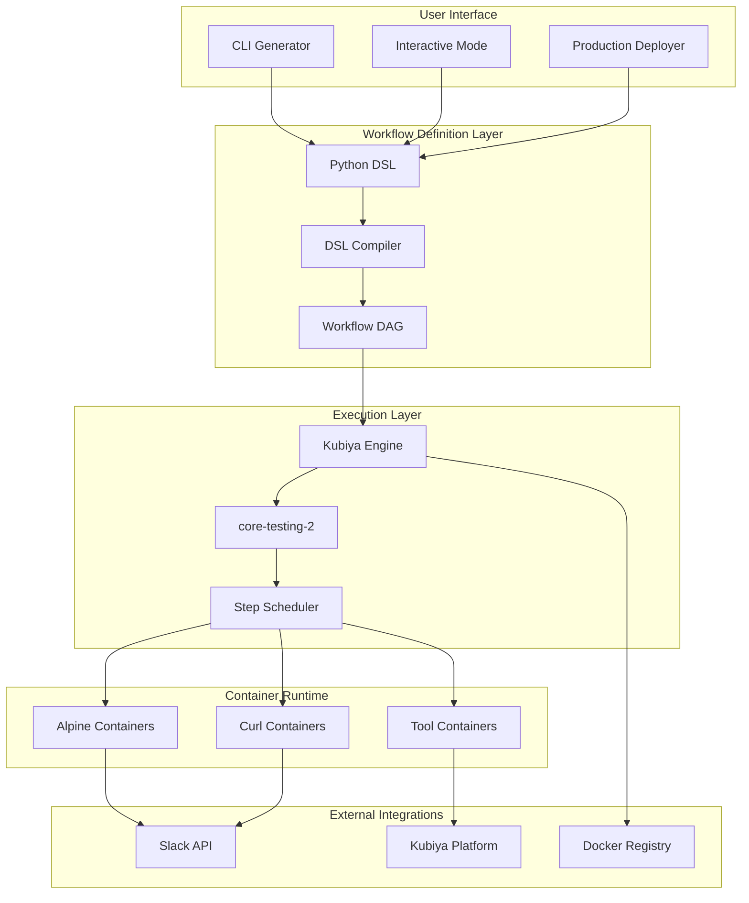
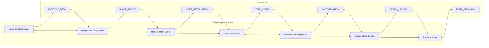
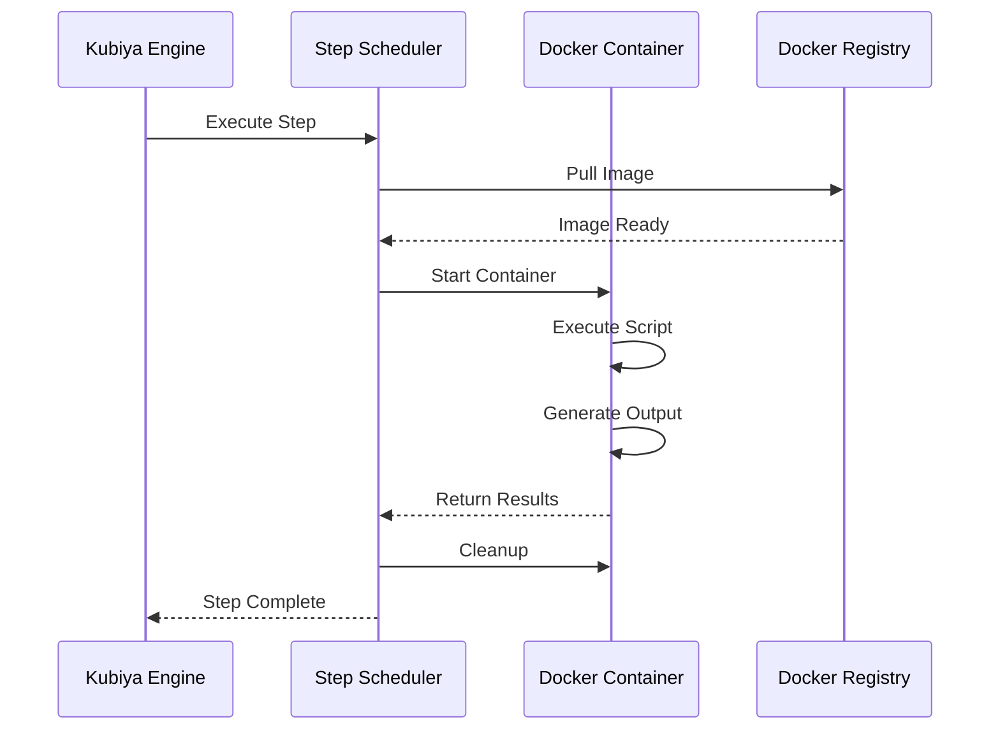
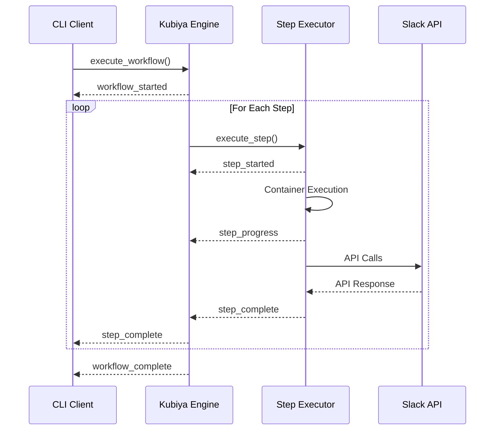

# 🏗️ Architecture Documentation

## Overview

The Kubiya Incident Response Workflow is built on a microservices architecture using containerized execution, event-driven processing, and declarative workflow definitions.

## System Architecture



## DSL to DAG Compilation Process

### 1. DSL Definition
```python
# Human-readable workflow definition
workflow = (Workflow("incident-response-production")
            .description("Production incident response")
            .type("chain")
            .runner("core-testing-2"))

step = Step("parse-incident-event")
step.data = {
    "name": "parse-incident-event",
    "executor": {
        "type": "tool",
        "config": {
            "tool_def": {
                "name": "parse_incident_event_production",
                "type": "docker",
                "image": "alpine:latest",
                "content": "#!/bin/sh\necho 'Parsing incident...'"
            }
        }
    },
    "output": "INCIDENT_DATA"
}

workflow.data["steps"] = [step.data]
```

### 2. Compilation to JSON DAG
```json
{
  "name": "incident-response-production",
  "description": "Production incident response with real Slack integration and Block Kit",
  "type": "chain",
  "runner": "core-testing-2",
  "params": {
    "incident_event": "${incident_event}",
    "slack_users": "${slack_users:shaked@kubiya.ai,amit@example.com}",
    "create_real_channel": "${create_real_channel:true}"
  },
  "steps": [
    {
      "name": "parse-incident-event",
      "executor": {
        "type": "tool",
        "config": {
          "tool_def": {
            "name": "parse_incident_event_production",
            "description": "Parse incident event with user resolution",
            "type": "docker",
            "image": "alpine:latest",
            "content": "#!/bin/sh\necho 'Parsing incident...'"
          },
          "args": {
            "incident_event": "${incident_event}",
            "slack_users": "${slack_users}"
          }
        }
      },
      "output": "INCIDENT_DATA",
      "depends": []
    }
  ]
}
```

### 3. DAG Execution Graph


## Container Strategy

### Base Images
- **alpine:latest**: Minimal Linux distribution (5MB)
- **curlimages/curl:latest**: Specialized for HTTP operations
- **Custom images**: Built on Alpine for specific tools

### Container Lifecycle


### Security Model
- **Isolated Execution**: Each step runs in fresh container
- **No Persistence**: Containers are ephemeral
- **Limited Network**: Only required external connections
- **Read-only Filesystem**: Prevents modification attacks
- **Resource Limits**: CPU/memory constraints

## Event-Driven Processing

### Workflow Events


### Event Types
- `workflow_started`: Workflow execution begins
- `step_started`: Individual step begins
- `step_progress`: Step execution updates
- `step_complete`: Step finishes (success/failure)
- `workflow_complete`: All steps finished

## Data Flow Architecture

### Parameter Injection
```bash
# Environment variables are injected into containers
export incident_event='{"id":"PROD-001","title":"Database Issue"}'
export slack_users="user1@company.com,user2@company.com"

# Container receives these as environment variables
#!/bin/sh
INCIDENT_ID=$(echo "$incident_event" | grep -o '"id":"[^"]*"' | cut -d'"' -f4)
USERS_INPUT=$(echo "$slack_users")
```

### Output Chaining
```json
{
  "step_1_output": "INCIDENT_DATA",
  "step_2_input": "${INCIDENT_DATA}",
  "step_2_output": "SLACK_TOKEN",
  "step_3_input": "${INCIDENT_DATA},${SLACK_TOKEN}"
}
```

### JSON Processing
```bash
# Extract specific fields from JSON output
CHANNEL_ID=$(echo "$war_room" | grep -o '"channel_id":"[^"]*"' | cut -d'"' -f4)
USER_IDS=$(echo "$user_resolution" | grep -o '"user_ids":"[^"]*"' | cut -d'"' -f4)

# Generate structured output
echo "{
  \"channel_id\": \"$CHANNEL_ID\",
  \"users_invited\": \"$USER_IDS\",
  \"status\": \"completed\"
}"
```

## Scalability Considerations

### Horizontal Scaling
- **Stateless Execution**: No shared state between workflows
- **Container Isolation**: Independent scaling per step type
- **Event Streaming**: Asynchronous processing

### Performance Optimizations
- **Image Caching**: Pre-pulled base images
- **Parallel Steps**: Independent steps run concurrently
- **Resource Pooling**: Reused container infrastructure

### Monitoring Integration
- **Execution Metrics**: Step timing, success rates
- **Resource Usage**: CPU, memory, network per step
- **Error Tracking**: Failed steps, retry logic

## Extension Points

### Custom Executors
```python
# Add new executor types
{
  "type": "custom_integration",
  "config": {
    "service": "datadog",
    "action": "create_incident",
    "parameters": {...}
  }
}
```

### Tool Registry
```python
# Reusable tool definitions
tool_registry = {
    "kubectl": {
        "image": "bitnami/kubectl:latest",
        "content": "#!/bin/bash\nkubectl get pods"
    },
    "aws_cli": {
        "image": "amazon/aws-cli:latest", 
        "content": "#!/bin/bash\naws ec2 describe-instances"
    }
}
```

### Plugin System
- **Pre-step Hooks**: Authentication, validation
- **Post-step Processing**: Logging, notifications
- **Error Handlers**: Retry logic, fallback actions

This architecture ensures reliable, scalable, and secure incident response automation while maintaining flexibility for customization and extension.