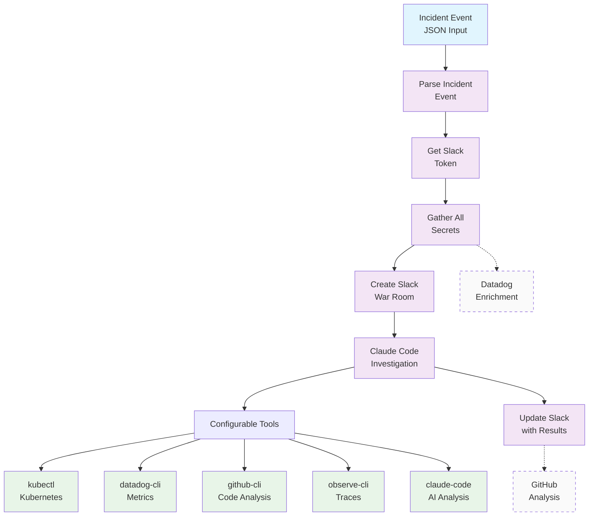
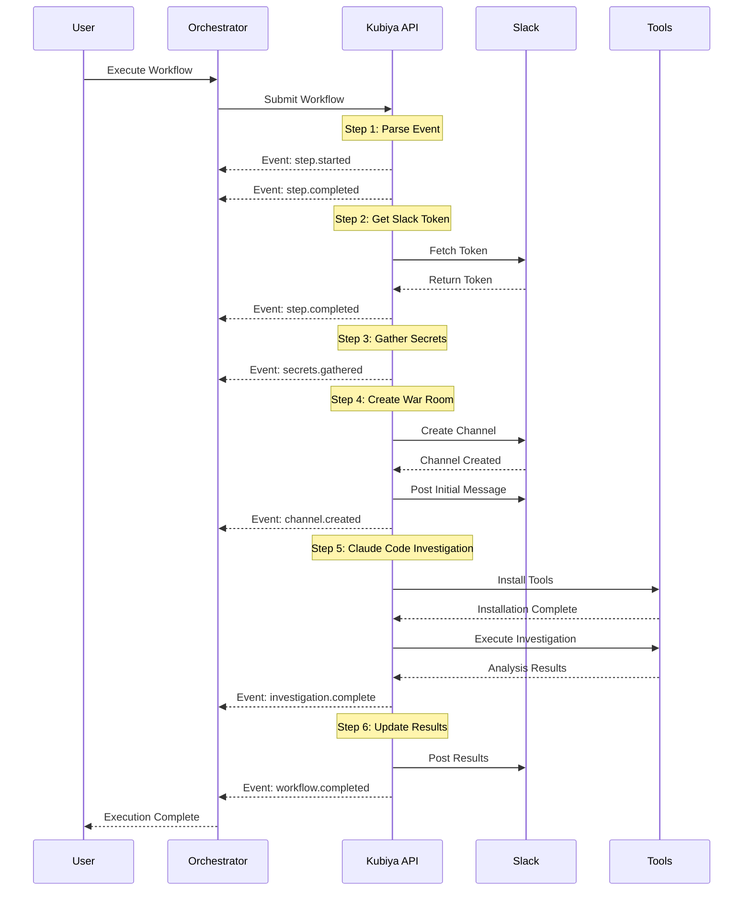
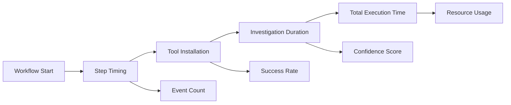

# Production Incident Response Workflow

A comprehensive, production-grade incident response workflow built with the Kubiya SDK. This workflow provides automated incident investigation with configurable Claude Code CLI tools, real-time Slack integration, and comprehensive monitoring capabilities.

## 🚀 Features

- **Configurable Tool Definitions**: Easily extend and customize CLI tools for Claude Code investigation
- **Production-Grade Architecture**: Modular, type-safe design with Pydantic models
- **Real-time Streaming**: SSE-based workflow execution with live progress updates
- **Comprehensive Integrations**: Slack, Datadog, GitHub, Kubernetes, and more
- **Flexible Configuration**: Multiple deployment modes (production, minimal, custom)
- **Robust Error Handling**: Graceful degradation and demo modes
- **Security-First**: Proper secrets management and validation

## 📋 Architecture Overview



## 🏗️ Project Structure

```
production_incident_response/
├── models/                    # Pydantic data models
│   ├── __init__.py
│   ├── incident.py           # Incident event and data models
│   ├── config.py             # Configuration models
│   ├── secrets.py            # Secrets and credentials models
│   └── analysis.py           # Investigation results models
├── components/               # Modular workflow components
│   ├── __init__.py
│   ├── parsers.py           # Incident parsing logic
│   ├── integrations.py      # External service integrations
│   ├── analyzers.py         # Investigation and analysis
│   └── builders.py          # Workflow construction
├── tools/                   # Tool management and generation
│   ├── __init__.py
│   ├── generator.py         # Dynamic tool script generation
│   └── registry.py          # Predefined tool definitions
├── config/                  # Configuration management
│   ├── __init__.py
│   ├── examples.py          # Configuration templates
│   └── validation.py        # Configuration validation
├── tests/                   # Test suites
│   ├── __init__.py
│   ├── test_models.py
│   ├── test_components.py
│   └── test_integration.py
├── main.py                  # Main entry point and CLI
└── README.md               # This file
```

## 🔧 Quick Start

### 1. Installation

```bash
# Clone the repository
git clone <repository-url>
cd production_incident_response

# Install dependencies
pip install -r requirements.txt

# Set up environment
export KUBIYA_API_KEY="your-api-key-here"
```

### 2. Basic Usage

```python
from main import IncidentResponseOrchestrator
from config.examples import create_example_config
from components.parsers import IncidentParser

# Create configuration
config = create_example_config()

# Create orchestrator
orchestrator = IncidentResponseOrchestrator(config)

# Create test incident
incident = IncidentParser.create_test_event()

# Execute workflow
for event in orchestrator.execute_workflow(incident):
    print(f"Event: {event}")
```

### 3. Command Line Interface

```bash
# Generate configuration template
python main.py --generate-config default

# Execute with test event
python main.py --execute --test-event --workflow-type production

# Custom tools execution
python main.py --execute --test-event --tools kubectl,datadog-cli,github-cli

# Minimal workflow for testing
python main.py --execute --test-event --workflow-type minimal --demo
```

## 🛠️ Tool Configuration

The workflow supports configurable Claude Code tool definitions. Tools can be easily extended and customized:

### Available Tools

| Tool | Description | Configuration |
|------|-------------|---------------|
| `kubectl` | Kubernetes cluster management | In-cluster or external |
| `helm` | Kubernetes package manager | Chart analysis |
| `argocd` | GitOps deployment management | Deployment tracking |
| `datadog-cli` | Metrics and monitoring | API integration |
| `github-cli` | Code and repository analysis | PR and commit tracking |
| `observe-cli` | Observability and tracing | Log analysis |
| `claude-code` | AI-powered investigation | Interactive analysis |

### Custom Tool Definition

```python
from models.config import ToolDefinition, ToolType, EnvironmentVariable

custom_tool = ToolDefinition(
    name="my-custom-tool",
    type=ToolType.CLI,
    description="Custom monitoring tool",
    install_commands=[
        "curl -L https://releases.example.com/tool | tar -xz",
        "mv tool /usr/local/bin/"
    ],
    environment_variables=[
        EnvironmentVariable(name="TOOL_API_KEY", value="${TOOL_API_KEY}", secret=True)
    ],
    validation_commands=["tool --version"],
    usage_examples=["tool status", "tool metrics --last 1h"],
    priority=50
)
```

### File Mounts and Extensions

```python
from models.config import VolumeMount

tool_with_mounts = ToolDefinition(
    name="file-analyzer",
    type=ToolType.CLI,
    volume_mounts=[
        VolumeMount(
            host_path="/var/log",
            container_path="/logs",
            readonly=True
        ),
        VolumeMount(
            host_path="/etc/config",
            container_path="/config",
            readonly=True
        )
    ],
    install_commands=[
        "apk add --no-cache file-analysis-tool"
    ],
    post_install_commands=[
        "file-analysis-tool --setup /config/analysis.conf"
    ]
)
```

## 📊 Workflow Execution Flow



## 🔒 Security Features

### Secrets Management

- Environment variable substitution: `${SECRET_NAME}`
- Kubernetes service account integration
- Demo mode with safe fallbacks
- Secret validation and masking

### Configuration Validation

```python
from config.validation import ConfigValidator, SecurityValidator

# Validate configuration
validation_result = ConfigValidator.validate(config)
if not validation_result.valid:
    print("Configuration errors:", validation_result.errors)

# Security validation
security_result = SecurityValidator.validate_security(config)
if security_result.errors:
    print("Security issues:", security_result.errors)
```

### Safe Defaults

- Read-only volume mounts by default
- Non-privileged containers
- Timeout limits and resource constraints
- Input validation and sanitization

## 📈 Monitoring and Observability

### Real-time Progress Tracking

```python
# Stream execution events
for event in orchestrator.execute_workflow(incident, stream=True):
    if event.get('type') == 'step.completed':
        print(f"✅ Completed: {event.get('step_name')}")
    elif event.get('type') == 'step.failed':
        print(f"❌ Failed: {event.get('step_name')}")
    elif event.get('type') == 'heartbeat':
        print("💓 Workflow alive")
```

### Performance Metrics



### Slack Integration

- Real-time progress updates
- Rich message formatting with blocks
- Channel creation and management
- Error notifications and alerts

## 🧪 Testing

### Unit Tests

```bash
# Run all tests
python -m pytest tests/

# Run specific test module
python -m pytest tests/test_models.py -v

# Run with coverage
python -m pytest tests/ --cov=. --cov-report=html
```

### Integration Tests

```bash
# Test with demo mode
python main.py --execute --test-event --demo --validate

# Test custom tool configuration
python main.py --execute --test-event --tools kubectl,jq --demo
```

### Test Scenarios

1. **Basic Workflow**: Parse → Investigate → Report
2. **Error Handling**: Invalid input, API failures, timeouts
3. **Tool Configuration**: Custom tools, missing dependencies
4. **Security**: Secret validation, privilege escalation
5. **Performance**: Large events, long investigations

## 🚀 Deployment

### Production Configuration

```yaml
# config.yaml
name: "production-incident-response"
version: "2.0.0"
runner: "production-runner"
timeout: 3600

claude_code:
  base_image: "ubuntu:22.04"
  installation_timeout: 600
  investigation_timeout: 1800
  kubernetes_enabled: true
  
slack:
  channel_prefix: "incident"
  use_blocks: true
  notify_on_start: true
  
enable_datadog_enrichment: true
enable_github_analysis: true
enable_kubernetes_analysis: true
```

### Kubernetes Deployment

```yaml
apiVersion: v1
kind: ConfigMap
metadata:
  name: incident-response-config
data:
  config.yaml: |
    # Production configuration here
---
apiVersion: batch/v1
kind: Job
metadata:
  name: incident-response-workflow
spec:
  template:
    spec:
      containers:
      - name: workflow
        image: incident-response:latest
        command: ["python", "main.py"]
        args: ["--config", "/config/config.yaml", "--execute"]
        volumeMounts:
        - name: config
          mountPath: /config
      volumes:
      - name: config
        configMap:
          name: incident-response-config
```

## 🔧 Configuration Examples

### Minimal Configuration

```python
config = create_minimal_config()
# Only essential tools: jq, kubectl, datadog-cli
# Reduced timeouts for faster testing
# Demo mode enabled
```

### Full Configuration

```python
config = create_full_config()
# All available tools installed
# Extended timeouts for comprehensive analysis
# All integrations enabled
```

### Custom Configuration

```python
from tools.registry import ToolRegistry

registry = ToolRegistry()
custom_tools = [
    registry.kubectl(),
    registry.datadog_cli(),
    my_custom_tool
]

config = WorkflowConfig(
    name="custom-incident-response",
    claude_code=ClaudeCodeConfig(tools=custom_tools),
    # ... other settings
)
```

## 📚 API Reference

### Core Classes

- `IncidentEvent`: Raw incident data from external systems
- `IncidentData`: Processed incident information
- `WorkflowConfig`: Complete workflow configuration
- `ToolDefinition`: Individual tool configuration
- `InvestigationAnalysis`: Analysis results and recommendations

### Main Functions

- `create_production_workflow()`: Standard production workflow
- `create_test_workflow()`: Minimal testing workflow
- `create_custom_tool_workflow()`: Workflow with specific tools

## 🤝 Contributing

1. Fork the repository
2. Create a feature branch
3. Add tests for new functionality
4. Ensure all tests pass
5. Submit a pull request

### Adding New Tools

1. Create tool definition in `tools/registry.py`
2. Add installation and validation logic
3. Update configuration examples
4. Add tests and documentation

### Adding New Integrations

1. Create integration class in `components/integrations.py`
2. Implement required methods
3. Add to workflow builder
4. Test with demo mode

## 📄 License

This project is licensed under the MIT License - see the LICENSE file for details.

## 🆘 Support

- Create an issue for bug reports
- Join our Slack channel for questions
- Check the documentation for guides
- Review examples for common patterns

---

**Ready to handle incidents like a pro!** 🚀

This production-grade workflow provides everything you need for comprehensive incident response with configurable tools, real-time monitoring, and robust error handling.