# Container Execution Model

```mermaid
graph LR
    subgraph "📦 Container Lifecycle"
        A[🏗️ Image Pull] --> B[🚀 Container Start]
        B --> C[📥 Environment Injection]
        C --> D[🔧 Script Execution]
        D --> E[📤 Output Generation]
        E --> F[🧹 Container Cleanup]
    end
    
    subgraph "🔒 Security Model"
        G[👤 Non-root User]
        H[📂 Read-only Filesystem]
        I[🌐 Limited Network]
        J[⏱️ Resource Limits]
        K[🔄 Ephemeral Storage]
    end
    
    subgraph "🏔️ Alpine Containers"
        A1[parse-incident-event<br/>5MB Alpine]
        A2[technical-investigation<br/>Built-in Tools Only]
        A3[final-summary<br/>JSON Processing]
    end
    
    subgraph "🌐 Curl Containers"
        C1[resolve-slack-users<br/>API Operations]
        C2[create-war-room<br/>Slack Channel Creation]
        C3[update-slack-thread<br/>Message Posting]
    end
    
    A --> A1
    A --> A2
    A --> A3
    A --> C1
    A --> C2
    A --> C3
    
    B --> G
    B --> H
    B --> I
    B --> J
    B --> K
    
    classDef alpine fill:#e8f5e8,stroke:#2e7d32,stroke-width:2px
    classDef curl fill:#e3f2fd,stroke:#1565c0,stroke-width:2px
    classDef security fill:#fff3e0,stroke:#ef6c00,stroke-width:2px
    classDef lifecycle fill:#f3e5f5,stroke:#7b1fa2,stroke-width:2px
    
    class A,B,C,D,E,F lifecycle
    class G,H,I,J,K security
    class A1,A2,A3 alpine
    class C1,C2,C3 curl
```

## Container Lifecycle

Each workflow step executes in an isolated container:

1. **Image Pull**: Base images cached for performance
2. **Container Start**: Fresh environment for each execution
3. **Environment Injection**: Parameters passed as environment variables
4. **Script Execution**: Shell scripts with embedded logic
5. **Output Generation**: Structured JSON responses
6. **Container Cleanup**: Automatic cleanup after execution

## Security Model

- **Non-root Execution**: Containers run as non-privileged users
- **Read-only Filesystem**: Prevents unauthorized modifications
- **Limited Network Access**: Only required external connections
- **Resource Limits**: CPU and memory constraints
- **Ephemeral Storage**: No persistent data storage

## Image Strategy

- **Alpine Linux**: Minimal 5MB base images
- **Specialized Images**: curl, kubectl, aws-cli as needed
- **No External Dependencies**: Self-contained execution
- **Version Pinning**: Specific image versions for reproducibility
