# Data Flow and Execution Sequence

```mermaid
sequenceDiagram
    participant U as 👤 User
    participant CLI as 🔧 CLI Tool
    participant E as 🎯 Kubiya Engine
    participant C1 as 🐳 Parse Container
    participant C2 as 🐳 Slack Setup
    participant C3 as 🐳 User Resolution
    participant C4 as 🐳 War Room Creation
    participant C5 as 🐳 Investigation
    participant C6 as 🐳 Thread Update
    participant C7 as 🐳 Final Summary
    participant S as 💬 Slack API
    
    U->>CLI: Execute Workflow
    CLI->>E: Submit DAG + Parameters
    E-->>CLI: workflow_started
    
    Note over E: Step 1: Parse Incident Event
    E->>C1: incident_event, slack_users
    C1->>C1: Extract ID, Title, Severity
    C1->>C1: Generate Channel Name
    C1-->>E: INCIDENT_DATA
    E-->>CLI: step_complete(parse-incident-event)
    
    Note over E: Step 2: Setup Slack Integration
    E->>C2: Kubiya API Call
    C2->>E: Get Slack Token
    C2-->>E: SLACK_TOKEN
    E-->>CLI: step_complete(setup-slack-integration)
    
    Note over E: Step 3: Resolve Slack Users
    E->>C3: INCIDENT_DATA + SLACK_TOKEN
    C3->>S: GET /api/users.list
    S-->>C3: Users JSON
    C3->>C3: Email → User ID Resolution
    C3-->>E: USER_RESOLUTION
    E-->>CLI: step_complete(resolve-slack-users)
    
    Note over E: Step 4: Create War Room
    E->>C4: INCIDENT_DATA + SLACK_TOKEN + USER_RESOLUTION
    C4->>S: POST /api/conversations.create
    S-->>C4: Channel Created
    C4->>S: POST /api/conversations.invite
    S-->>C4: Users Invited
    C4->>S: POST /api/chat.postMessage (Block Kit)
    S-->>C4: Message Posted
    C4-->>E: WAR_ROOM
    E-->>CLI: step_complete(create-war-room)
    
    Note over E: Step 5: Technical Investigation
    E->>C5: INCIDENT_DATA + WAR_ROOM
    C5->>C5: System Analysis
    C5->>C5: Generate Recommendations
    C5-->>E: INVESTIGATION
    E-->>CLI: step_complete(technical-investigation)
    
    Note over E: Step 6: Update Slack Thread
    E->>C6: SLACK_TOKEN + WAR_ROOM + INVESTIGATION
    C6->>S: POST /api/chat.postMessage (threaded)
    S-->>C6: Thread Updated
    C6-->>E: SLACK_UPDATE
    E-->>CLI: step_complete(update-slack-thread)
    
    Note over E: Step 7: Final Summary
    E->>C7: All Previous Outputs
    C7->>C7: Generate Success Metrics
    C7->>C7: Calculate Overall Status
    C7-->>E: FINAL_SUMMARY
    E-->>CLI: step_complete(final-summary)
    
    E-->>CLI: workflow_complete(success=true)
    CLI-->>U: 🎉 Incident Response Complete!
```

## Execution Flow

The workflow follows a strict sequence of operations:

1. **User Initiation**: User triggers workflow via CLI
2. **Parameter Injection**: Environment variables passed to containers
3. **Sequential Execution**: Each step depends on previous outputs
4. **API Integration**: Real-time Slack API operations
5. **Result Aggregation**: Comprehensive final summary

## Data Transformation

- **Input**: Raw incident JSON + user emails
- **Processing**: Multi-step enrichment and validation
- **Output**: Structured incident response with metrics

## Error Handling

- **Container Failures**: Isolated impact, detailed logging
- **API Errors**: Graceful degradation with fallbacks
- **Validation Errors**: Clear error messages and guidance
