# Workflow Execution Flow

```mermaid
graph TD
    Start([🚨 Incident Triggered]) --> A[📋 Parse Incident Event]
    A --> B[🔑 Setup Slack Integration]
    B --> C[👥 Resolve Slack Users]
    C --> D[🏗️ Create War Room]
    D --> E[🔬 Technical Investigation]
    E --> F[💬 Update Slack Thread]
    F --> G[📊 Final Summary]
    G --> End([✅ Response Complete])
    
    %% Step Details
    A --> A1[Extract Incident ID]
    A --> A2[Generate Channel Name]
    A --> A3[Validate Severity]
    
    C --> C1[Search by Email]
    C --> C2[Search by Display Name]
    C --> C3[Search by Username]
    C --> C4[Fuzzy Real Name Search]
    
    D --> D1[Create Slack Channel]
    D --> D2[Invite Users]
    D --> D3[Post Block Kit Message]
    
    E --> E1[System Information]
    E --> E2[Network Connectivity]
    E --> E3[Service Health Checks]
    E --> E4[Generate Recommendations]
    
    %% Container Information
    A -.->|alpine:latest| ContainerA[🐳 Alpine Container]
    C -.->|curlimages/curl:latest| ContainerC[🐳 Curl Container]
    D -.->|curlimages/curl:latest| ContainerD[🐳 Curl Container]
    E -.->|alpine:latest| ContainerE[🐳 Alpine Container]
    F -.->|curlimages/curl:latest| ContainerF[🐳 Curl Container]
    G -.->|alpine:latest| ContainerG[🐳 Alpine Container]
    
    %% Data Flow
    A -->|INCIDENT_DATA| B
    B -->|SLACK_TOKEN| C
    C -->|USER_RESOLUTION| D
    D -->|WAR_ROOM| E
    E -->|INVESTIGATION| F
    F -->|SLACK_UPDATE| G
    
    %% Styling
    classDef startEnd fill:#e1f5fe,stroke:#01579b,stroke-width:3px
    classDef parseStep fill:#f3e5f5,stroke:#4a148c,stroke-width:2px
    classDef slackStep fill:#e8f5e8,stroke:#1b5e20,stroke-width:2px
    classDef investigationStep fill:#fff3e0,stroke:#e65100,stroke-width:2px
    classDef containerStep fill:#f5f5f5,stroke:#424242,stroke-width:1px,stroke-dasharray: 5 5
    
    class Start,End startEnd
    class A,A1,A2,A3 parseStep
    class B,C,C1,C2,C3,C4,D,D1,D2,D3,F slackStep
    class E,E1,E2,E3,E4,G investigationStep
    class ContainerA,ContainerC,ContainerD,ContainerE,ContainerF,ContainerG containerStep
```

## Workflow Steps

1. **Parse Incident Event** - Validates and structures incident data
2. **Setup Slack Integration** - Retrieves Slack API token
3. **Resolve Slack Users** - Converts emails to Slack user IDs
4. **Create War Room** - Creates channel with Block Kit message
5. **Technical Investigation** - Automated system analysis
6. **Update Slack Thread** - Posts investigation as threaded reply
7. **Final Summary** - Comprehensive incident report

## Container Strategy

Each step runs in isolated containers:
- **Alpine containers**: Lightweight system operations
- **Curl containers**: HTTP/API operations
- **Ephemeral execution**: No persistent state
- **Security isolation**: Limited permissions and network access
